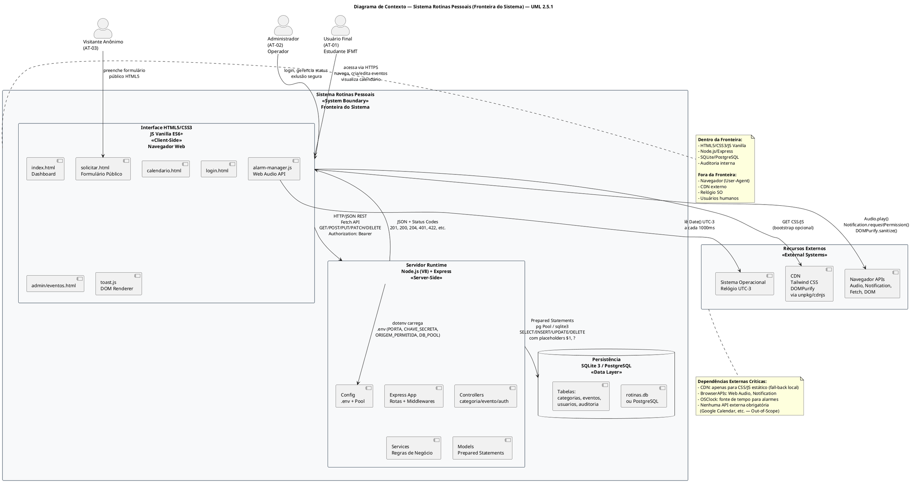
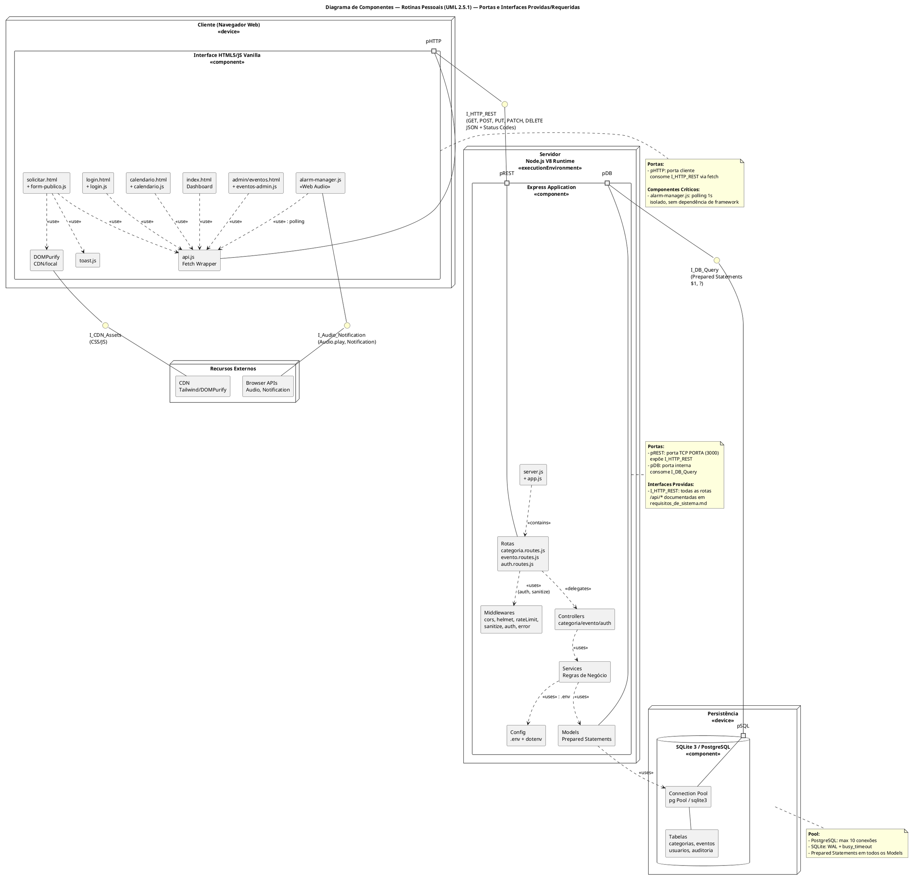
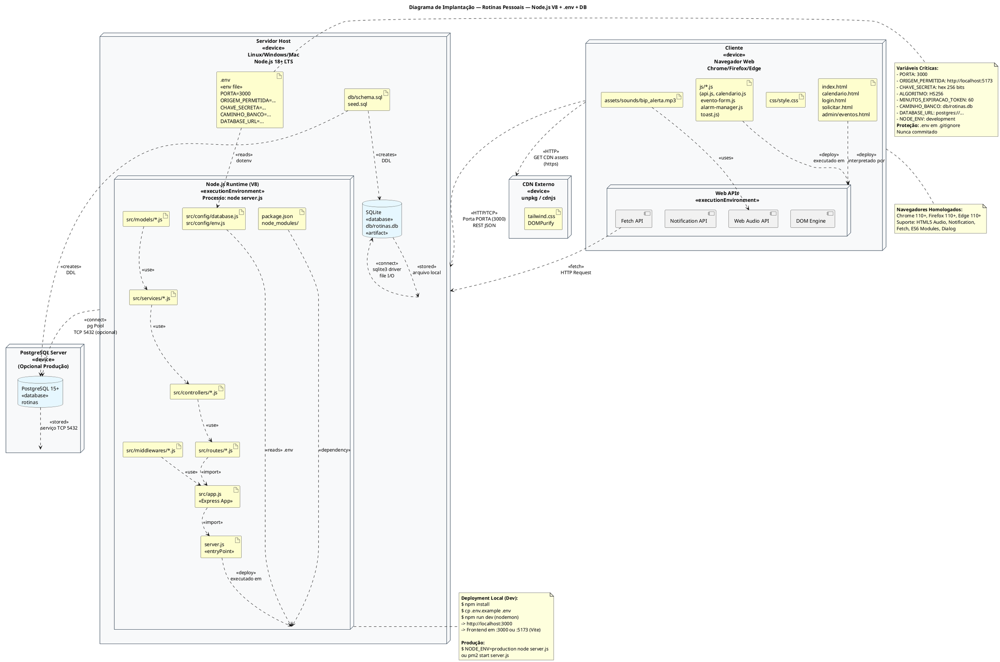
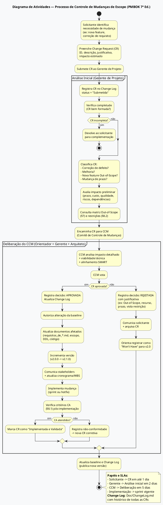

# Declaração de Escopo do Projeto — Sistema Dinâmico de Gerenciamento de Rotinas (Rotinas Pessoais)

**Documento de Governança de Projeto — Padrão PMBOK 7ª Ed. & UML 2.5.1**  
**Projeto:** Rotinas Pessoais — IFMT Campus Barra do Garças  
**Versão:** 2.0.0  
**Data:** 03 de Setembro de 2026  
**Autores:** João Eduardo Sousa Ferreira e Lara Ohana Rodrigues Galvão  
**Orientador:** Prof. Carlos David Rocha de Souza  
**Instituição:** Instituto Federal de Mato Grosso (IFMT)  
**Stack Definida:** Node.js 18+ (V8) + Express 4.x + HTML5 Semântico + CSS3 + JavaScript Vanilla ES6+ + SQLite 3 / PostgreSQL 15+ (Prepared Statements)  
**Documentos Relacionados:** `requisitos_de_usuario.md` (URD) | `requisitos_de_sistema.md` (SRS) | `requisito_usuario.md` / `requisito_sistemas.md` / `escopo_projeto.md` (legados)

---

## Sumário

1. [Justificativa de Engenharia e Objetivos SMART](#1-justificativa-de-engenharia-e-objetivos-smart)
2. [Delimitação das Fronteiras do Sistema — Diagrama de Contexto PlantUML](#2-delimitação-das-fronteiras-do-sistema--diagrama-de-contexto-plantuml)
3. [Escopo do Produto — Módulos Arquiteturais e Entregáveis Físicos](#3-escopo-do-produto--módulos-arquiteturais-e-entregáveis-físicos)
4. [Diagrama de Componentes UML 2.5.1 — Portas e Interfaces](#4-diagrama-de-componentes-uml-251--portas-e-interfaces)
5. [Diagrama de Implantação (Deployment)](#5-diagrama-de-implantação-deployment)
6. [Estrutura Analítica do Projeto (EAP/WBS) e Dicionário de Entregáveis](#6-estrutura-analítica-do-projeto-eapwbs-e-dicionário-de-entregáveis)
7. [Limites Explícitos — In-Scope e Out-of-Scope](#7-limites-explícitos--in-scope-e-out-of-scope)
8. [Matrizes de Critérios de Aceitação, Restrições/Premissas e Riscos Técnicos](#8-matrizes-de-critérios-de-aceitação-restriçõespremissas-e-riscos-técnicos)
9. [Governança e Processo de Controle de Mudanças de Escopo — Diagrama de Atividades](#9-governança-e-processo-de-controle-de-mudanças-de-escopo--diagrama-de-atividades)
10. [Aprovação](#10-aprovação)

---

## 1. Justificativa de Engenharia e Objetivos SMART

### 1.1 Problema e Oportunidade

Estudantes do Ensino Médio Técnico Integrado ao IFMT acumulam múltiplas rotinas concorrentes (acadêmica, doméstica e profissional) sem ferramenta centralizada que combine **calendarização visual**, **categorização por domínio** e **alertas sonoros autônomos** no navegador. Soluções genéricas (Google Calendar, Trello) são dispersas, exigem conta externa, não oferecem categorização acadêmica específica e não emitem alarmes sonoros configuráveis com precisão de 1 segundo sem integração externa.

A ausência de controle temporal resulta em perda de prazos, baixa produtividade e sobrecarga cognitiva — problema mensurável em ambiente acadêmico.

### 1.2 Justificativa Técnica da Stack Node.js + HTML5

| Decisão | Justificativa de Engenharia |
|---|---|
| **HTML5 Semântico + CSS3 + JS Vanilla (sem framework SPA)** | Maximiza aprendizado de fundamentos Web, elimina dependência de build complexo (React/Vite), reduz bundle para <50 KB, garante compatibilidade universal e facilita auditoria de segurança (sem virtual DOM). Uso de `Fetch API`, `DOMPurify`, `HTML5 Audio` e `Notification API` nativas. |
| **Node.js 18+ + Express 4.x** | Runtime não-bloqueante ideal para I/O-bound (API REST CRUD); Event Loop + libuv thread pool trata concorrência sem threads manuais; ecossistema maduro (`pg`, `sqlite3`, `bcrypt`, `jsonwebtoken`, `express-validator`, `helmet`). Unifica linguagem (JS full-stack). |
| **SQLite 3 (dev) / PostgreSQL 15+ (prod)** | SQLite: zero-config, ACID, WAL, ideal para ambiente acadêmico e monoposto. PostgreSQL: robusto, escalável, suporta pool de conexões e tipos `TIMESTAMPTZ`/`JSONB` para produção. Ambos com **Prepared Statements** parametrizados ($1, ?) eliminam SQL Injection. |
| **Vanilla JS + Tailwind/Vanilla CSS** | CSS utilitário ou puro para responsividade mobile-first sem overhead de framework; JS modular (`api.js`, `alarm-manager.js`) com `type="module"` e `history.pushState` para SPA leve. |

### 1.3 Objetivos SMART

| ID | Objetivo SMART | Métrica | Prazo | Relevância |
|---|---|---|---|---|
| **OBJ-01** | Entregar **API REST Node.js/Express** com **12 endpoints** (`/api/categorias`, `/api/eventos`, `/api/auth/*`, `/api/saude`) validados via `express-validator` e 100% cobertos por Prepared Statements | 12 rotas funcionais; 0 concatenação SQL; testes `autocannon` p95 ≤200 ms | Sprint 2 (Set/2026) | Core de persistência e segurança |
| **OBJ-02** | Entregar **Frontend HTML5 Vanilla** com **6 páginas** (`index.html`, `calendario.html`, `login.html`, `solicitar.html`, `admin/eventos.html` + componentes JS) e validação client-side via Constraint Validation API + Toast em ≤300 ms | 6 páginas W3C válidas; Lighthouse Performance ≥85, Accessibility ≥90 | Sprint 3 (Set/2026) | Experiência do usuário sem framework |
| **OBJ-03** | Implementar **AlarmManager Vanilla** com tick 1000 ms, disparo de áudio em `HH:mm` com tolerância ≤1s e lembretes em 5/10/30/60/1440 min | Precisão ±1s em 100% dos casos de teste; cobertura de ambos os alarmes | Sprint 3 (Set/2026) | Diferencial funcional |
| **OBJ-04** | Garantir **segurança** com `bcrypt` (salt 12), JWT `HS256` em `Authorization: Bearer` ou cookie HTTP-Only, sanitização XSS (`escape` + DOMPurify) e `helmet` + `cors` | 0 vulnerabilidades OWASP Top 10 em varredura; testes de injeção bloqueados | Sprint 2 (Set/2026) | Conformidade OWASP ASVS |
| **OBJ-05** | Documentar **3 especificações formais** (`requisitos_de_usuario.md`, `requisitos_de_sistema.md`, `escopo_do_projeto.md`) conforme UML 2.5.1, ISO 29148 e PMBOK 7, com PlantUML e matrizes de rastreabilidade | 3 documentos aprovados pelo orientador; 100% dos requisitos rastreados RU→RSF→código | Entrega final (03/09/2026) | Governança e auditabilidade |

---

## 2. Delimitação das Fronteiras do Sistema — Diagrama de Contexto PlantUML

### 2.1 Diagrama de Contexto (C4 Nível 1 + UML System Boundary)



### 2.2 Definição Textual da Fronteira

| Elemento | Dentro da Fronteira (In-Boundary) | Fora da Fronteira (External) | Interface de Fronteira |
|---|---|---|---|
| **Interface HTML5/JS** | Páginas `.html` semânticas, CSS3, JS Vanilla modular (`api.js`, `alarm-manager.js`, `toast.js`), HTML5 Audio/ Notification, DOMPurify | Navegador Web (Chrome/Firefox/Edge), SO, hardware de áudio | HTTP/HTTPS, DOM APIs, `fetch()` |
| **Servidor Node.js** | Processo `node server.js` (V8), Express app, rotas, middlewares (`auth`, `sanitize`, `cors`, `helmet`, `rateLimit`), controllers, services, models, pool de conexões | Sistema operacional host, variáveis de ambiente `.env` (externas mas lidas na fronteira), rede TCP/IP | Porta `PORTA` (ex: 3000), `process.env` |
| **Persistência** | Arquivo `db/rotinas.db` (SQLite) ou instância PostgreSQL local, tabelas `categorias`, `eventos`, `usuarios`, `auditoria`, DDL `schema.sql`, índices, constraints | Sistema de arquivos OS, serviço PostgreSQL (se externo) | Driver `sqlite3`/`pg` via Prepared Statements |
| **Recursos Externos** | — | CDN (Tailwind, DOMPurify), CDNs de fontes, APIs de relógio (não usado; usa `Date()` local) | `GET https://cdn.jsdelivr.net/...` com SRI opcional |

> **Regra de Fronteira:** Qualquer dado que cruza a fronteira (HTTP request/response, leitura de `.env`, query SQL) deve ser validado/sanitizado no ponto de entrada (middleware).

---

## 3. Escopo do Produto — Módulos Arquiteturais e Entregáveis Físicos

### 3.1 Decomposição por Módulos Arquiteturais

| Módulo | Responsabilidade | Entregáveis Físicos de Código (Arquivos) | Interfaces Providas |
|---|---|---|---|
| **M01 — Frontend Público e Dashboard** | Landing, dashboard com métricas, navegação, layout responsivo | `frontend/index.html`, `frontend/css/style.css`, `frontend/js/dashboard.js`, `frontend/js/api.js`, `frontend/js/toast.js`, `frontend/assets/sounds/bip_alerta.mp3` | `GET /` (estático), `GET /api/eventos/dia/:data` (consumo) |
| **M02 — Calendário Calendarizado** | Visualização dia/semana/mês estilo Google Calendar, grid 24h, pílulas coloridas, modal detalhe | `frontend/calendario.html`, `frontend/js/calendario.js`, `frontend/css/style.css` | `GET /api/eventos?inicio&fim`, `GET /api/eventos/dia/:data` |
| **M03 — Gestão de Categorias** | CRUD de categorias com validação HEX e unicidade, UI de cards | `frontend/categoria-manager.html` (ou seção em `index.html`), `frontend/js/categoria-manager.js`, `api/src/routes/categoria.routes.js`, `api/src/controllers/categoria.controller.js`, `api/src/services/categoria.service.js`, `api/src/models/categoria.model.js` | `POST/GET/PUT/DELETE /api/categorias` |
| **M04 — Gestão de Eventos (Formulário)** | Formulário HTML5 semântico com validação Constraint API, sanitização DOMPurify, envio `fetch` | `frontend/js/evento-form.js`, `frontend/solicitar.html` (público), `frontend/calendario.html` (inline form), `api/src/routes/evento.routes.js`, `api/src/controllers/evento.controller.js`, `api/src/services/evento.service.js`, `api/src/models/evento.model.js` | `POST /api/eventos`, `GET /api/eventos/:id`, `PUT /api/eventos/:id` |
| **M05 — Autenticação e Autorização** | Login HTML5, JWT HS256, middleware `auth`, RBAC admin/usuario, cookies HTTP-Only | `frontend/login.html`, `frontend/js/login.js`, `frontend/admin/eventos.html`, `api/src/routes/auth.routes.js`, `api/src/controllers/auth.controller.js`, `api/src/services/auth.service.js`, `api/src/models/usuario.model.js`, `api/src/middlewares/auth.middleware.js` | `POST /api/auth/login`, `GET /api/auth/verificar`, `Authorization: Bearer` |
| **M06 — Gestão Operacional (Status e Exclusão Segura)** | Alteração de status com máquina de estados OCL, exclusão em duas etapas, auditoria | `frontend/admin/eventos.html`, `frontend/js/eventos-admin.js` (status dropdown, modal dupla confirmação), `api/src/routes/evento.routes.js` (PATCH /status, DELETE), `api/src/services/evento.service.js` (validarTransição), `api/src/models/auditoria.model.js` | `PATCH /api/eventos/:id/status`, `DELETE /api/eventos/:id` |
| **M07 — Alarmes e Notificações** | Tick 1000 ms, comparação `HH:mm` UTC-3, `Audio.play()`, `Notification` API, Toast, soneca | `frontend/js/alarm-manager.js`, `frontend/js/toast.js`, `frontend/assets/sounds/bip_alerta.mp3` | — (client-side; consome `GET /api/eventos`) |
| **M08 — Infraestrutura e Persistência** | Configuração `.env`, pool DB, DDL, seeds, middlewares transversais, health check | `api/.env`, `api/.env.example`, `api/server.js`, `api/src/app.js`, `api/src/config/database.js`, `api/src/config/env.js`, `api/src/middlewares/{cors,helmet,rateLimit,sanitize,error,logger}.js`, `api/db/schema.sql`, `api/db/seed.sql`, `api/db/rotinas.db`, `api/src/routes/saude.routes.js` | `GET /api/saude`, `process.env.*` |

### 3.2 Entregáveis Físicos Consolidados (Lista de Arquivos)

```
Entregáveis Físicos — Escopo do Produto (Node.js + HTML5 Vanilla)
├── Doc/                                    # Documentação
│   ├── requisitos_de_usuario.md            # URD (este escopo referencia)
│   ├── requisitos_de_sistema.md            # SRS
│   └── escopo_do_projeto.md                # Este arquivo
├── api/                                    # Módulos M03-M06, M08
│   ├── .env                                # protegida (não versionada)
│   ├── .env.example                        # modelo
│   ├── package.json                        # dependências Node.js
│   ├── server.js                           # entry point
│   ├── src/
│   │   ├── app.js
│   │   ├── config/{database.js, env.js, constants.js}
│   │   ├── middlewares/{auth.middleware.js, sanitize.middleware.js, cors.middleware.js, helmet, rateLimit, error, logger}
│   │   ├── models/{categoria.model.js, evento.model.js, usuario.model.js, auditoria.model.js}
│   │   ├── services/{categoria.service.js, evento.service.js, auth.service.js}
│   │   ├── controllers/{categoria.controller.js, evento.controller.js, auth.controller.js}
│   │   ├── routes/{categoria.routes.js, evento.routes.js, auth.routes.js, saude.routes.js}
│   │   └── utils/{sanitize.js, date.js}
│   └── db/{rotinas.db, schema.sql, seed.sql}
└── frontend/                               # Módulos M01, M02, M04, M05, M06, M07
    ├── index.html                          # Dashboard (M01)
    ├── calendario.html                     # Calendário (M02)
    ├── solicitar.html                      # Formulário público (M04)
    ├── login.html                          # Login (M05)
    ├── admin/eventos.html                  # Gestão operacional (M06)
    ├── css/style.css
    ├── js/{api.js, dashboard.js, calendario.js, evento-form.js, categoria-manager.js, alarm-manager.js, login.js, form-publico.js, toast.js}
    └── assets/sounds/bip_alerta.mp3
```

**Total estimado:** ~35 arquivos de código + 3 documentos = **38 artefatos entregáveis**.

---

## 4. Diagrama de Componentes UML 2.5.1 — Portas e Interfaces



### 4.1 Descrição de Interfaces

| Interface | Tipo | Provedor | Consumidor | Operações / Protocolo |
|---|---|---|---|---|
| `I_HTTP_REST` | Provida | `Backend` (pREST) | `Frontend` (pHTTP) | `GET/POST/PUT/PATCH/DELETE /api/*` com JSON; ver contratos §7 de `requisitos_de_sistema.md` |
| `I_DB_Query` | Provida | `DB` (pSQL) | `Backend` (pDB) | `query(sql, params)` com placeholders `$1` (pg) ou `?` (sqlite3); `pool.query()` / `db.all()` |
| `I_Audio_Notification` | Provida | `BrowserAPIs` | `Frontend` (`alarm-manager.js`) | `new Audio(src).play()`, `new Notification(title, opts)`, `Notification.requestPermission()` |
| `I_CDN_Assets` | Provida | `CDN` | `Frontend` | `GET https://cdn.jsdelivr.net/...` com `integrity` SRI |

---

## 5. Diagrama de Implantação (Deployment)



### 5.1 Especificação de Artefatos de Implantação

| Artefato | Local de Implantação | Protocolo | Requisito de Runtime |
|---|---|---|---|
| `*.html` (5 páginas) | Cliente — servido por `express.static('frontend')` ou servidor estático dedicado | HTTP `GET /` → `200 text/html` | Navegador com HTML5 |
| `css/style.css`, `js/*.js` | Cliente — `GET /css/style.css`, `GET /js/*.js` | HTTP `200 text/css`, `application/javascript` | `type="module"` se ES6 |
| `bip_alerta.mp3` | Cliente — `GET /assets/sounds/bip_alerta.mp3` | HTTP `200 audio/mpeg` | `Audio` API |
| `server.js` + `src/**/*` | Servidor Host — processo `node server.js` | — | Node.js 18+ LTS, `npm install` |
| `.env` | Servidor Host — arquivo local `api/.env` lido por `dotenv` | File I/O (leitura síncrona na inicialização apenas) | `chmod 600 .env` |
| `db/rotinas.db` | Servidor Host — arquivo `api/db/rotinas.db` | File I/O via `sqlite3` | `PRAGMA journal_mode=WAL` |
| `PostgreSQL` (opcional) | PGHost — serviço TCP `5432` | TCP `pg` Pool | PostgreSQL 15+, `DATABASE_URL` |
| `CDN assets` | CDN Externo | HTTPS `GET` | SRI hash opcional |

---

## 6. Estrutura Analítica do Projeto (EAP/WBS) e Dicionário de Entregáveis

### 6.1 WBS Hierárquico (Visual Textual)

```
1.0 PROJETO ROTINAS PESSOAIS (IFMT) — Sistema Node.js + HTML5 Vanilla
│
├── 1.1 GERENCIAMENTO DO PROJETO (PMBOK 7ª Ed.)
│   ├── 1.1.1 Termo de Abertura (TAP) e Kickoff
│   ├── 1.1.2 Declaração de Escopo (este documento) — escopo_do_projeto.md
│   ├── 1.1.3 Plano de Gerenciamento (Cronograma, Riscos, Qualidade)
│   └── 1.1.4 Reuniões de Acompanhamento e Status Reports
│
├── 1.2 ENGENHARIA DE REQUISITOS E ARQUITETURA (ISO 29148 / UML 2.5.1)
│   ├── 1.2.1 Especificação de Requisitos de Usuário (URD) — requisitos_de_usuario.md
│   │       ├── 1.2.1.1 Atores e Diagrama de Casos de Uso (PlantUML)
│   │       ├── 1.2.1.2 Catálogo RU com MoSCoW, Pré/Pós-condições e Fluxos
│   │       ├── 1.2.1.3 Histórias de Usuário + BDD Gherkin (Dado/Quando/Então)
│   │       └── 1.2.1.4 Diagramas de Sequência com Foco no Usuário (PlantUML)
│   ├── 1.2.2 Especificação de Requisitos de Sistema (SRS) — requisitos_de_sistema.md
│   │       ├── 1.2.2.1 RSF: Rotas, Middlewares, Payloads, Status Codes
│   │       ├── 1.2.2.2 RSNF: FURPS+/ISO 25010 (bcrypt, JWT, XSS, SQL Inj, Event Loop, Pool)
│   │       ├── 1.2.2.3 Diagramas de Sequência de Backend (PlantUML)
│   │       ├── 1.2.2.4 Diagrama de Classes com OCL
│   │       ├── 1.2.2.5 DDL Físico (Tabelas, CHECKs, FKs, Índices)
│   │       └── 1.2.2.6 Contratos API + Matriz de Rastreabilidade
│   └── 1.2.3 Modelagem de Dados e Diagramas Estruturais
│           ├── Diagrama de Contexto (System Boundary)
│           ├── Diagrama de Componentes (Portas/Interfaces)
│           └── Diagrama de Implantação (Deployment)
│
├── 1.3 DESENVOLVIMENTO BACKEND — Node.js + Express (M03-M06, M08)
│   ├── 1.3.1 Configuração e Infraestrutura
│   │       ├── 1.3.1.1 Inicialização do projeto (npm init, package.json, .env.example, .gitignore)
│   │       ├── 1.3.1.2 Configuração do Banco (database.js: Pool pg / sqlite3 WAL, schema.sql, seed.sql)
│   │       ├── 1.3.1.3 Middlewares Transversais (cors, helmet, rateLimit, logger, error)
│   │       └── 1.3.1.4 Health Check (GET /api/saude)
│   ├── 1.3.2 Módulo Categorias
│   │       ├── 1.3.2.1 Model categoria.model.js (Prepared Statements CRUD)
│   │       ├── 1.3.2.2 Service categoria.service.js (unicidade, FK check)
│   │       ├── 1.3.2.3 Controller categoria.controller.js
│   │       ├── 1.3.2.4 Rotas categoria.routes.js + sanitizeMiddleware
│   │       └── 1.3.2.5 Testes de integração categorias (POST 201, 400 dup, DELETE 409)
│   ├── 1.3.3 Módulo Eventos
│   │       ├── 1.3.3.1 Model evento.model.js (Prepared Statements + JOIN categorias)
│   │       ├── 1.3.3.2 Service evento.service.js (validação intervalo, FK, recorrência, OCL status)
│   │       ├── 1.3.3.3 Controller evento.controller.js
│   │       ├── 1.3.3.4 Rotas evento.routes.js (POST, GET, PUT, PATCH status, DELETE, GET /dia/:data)
│   │       └── 1.3.3.5 Testes de integração eventos (422 datas, 404 categoria, PATCH transição)
│   ├── 1.3.4 Módulo Autenticação e Auditoria
│   │       ├── 1.3.4.1 Model usuario.model.js + auditoria.model.js
│   │       ├── 1.3.4.2 Service auth.service.js (bcrypt, jwt sign/verify)
│   │       ├── 1.3.4.3 Controller auth.controller.js (login, verificar, logout)
│   │       ├── 1.3.4.4 Middleware auth.middleware.js (Bearer / cookie)
│   │       ├── 1.3.4.5 Rotas auth.routes.js + rateLimit em /login
│   │       └── 1.3.4.6 Testes de segurança (401 sem token, 403 role, bcrypt timing)
│   └── 1.3.5 Integração e Validação Backend
│           ├── Testes de carga (autocannon) — p95 ≤200ms
│           └── Testes de segurança (SQLi, XSS payloads)
│
├── 1.4 DESENVOLVIMENTO FRONTEND — HTML5 + CSS3 + JS Vanilla (M01, M02, M04-M07)
│   ├── 1.4.1 Estrutura Base e Design System
│   │       ├── 1.4.1.1 HTML5 semântico base (header, main, footer, dialog)
│   │       ├── 1.4.1.2 CSS3 (Tailwind build ou vanilla, responsive 320–1920px)
│   │       ├── 1.4.1.3 JS utils (api.js Fetch wrapper, toast.js, date helpers UTC-3)
│   │       └── 1.4.1.4 Homologação de navegadores (Chrome, Firefox, Edge)
│   ├── 1.4.2 Páginas e Componentes
│   │       ├── 1.4.2.1 Dashboard (index.html + dashboard.js) — métricas do dia
│   │       ├── 1.4.2.2 Calendário (calendario.html + calendario.js) — dia/semana/mês + modal detalhe
│   │       ├── 1.4.2.3 Formulário de Eventos (evento-form.js) — Constraint Validation + DOMPurify
│   │       ├── 1.4.2.4 Gerenciador de Categorias (categoria-manager.js) — CRUD visual
│   │       ├── 1.4.2.5 Formulário Público (solicitar.html + form-publico.js) — validação + Toast/DOM
│   │       └── 1.4.2.6 Login (login.html + login.js) — JWT storage + redirect
│   ├── 1.4.3 Módulo Administrativo
│   │       ├── 1.4.3.1 Admin Eventos (admin/eventos.html + eventos-admin.js)
│   │       ├── 1.4.3.2 Dropdown de status + validação OCL client-side
│   │       └── 1.4.3.3 Modal de exclusão em duas etapas (dialog + confirmação textual)
│   └── 1.4.4 Motor Autônomo de Alarmes
│           ├── 1.4.4.1 alarm-manager.js — setInterval 1000ms, comparação HH:mm UTC-3
│           ├── 1.4.4.2 Integração Web Audio API e Notification API
│           └── 1.4.4.3 Testes de precisão (±1s) e soneca
│
└── 1.5 VALIDAÇÃO, QUALIDADE E ENCERRAMENTO
    ├── 1.5.1 Testes de Integração e Interface
    │       ├── 1.5.1.1 Testes E2E (Playwright/Cypress) — fluxos críticos
    │       ├── 1.5.1.2 Testes de usabilidade (WCAG, Lighthouse)
    │       └── 1.5.1.3 Validação W3C HTML/CSS
    ├── 1.5.2 Documentação Final e Entrega
    │       ├── 1.5.2.1 README com instruções de execução (npm install, .env, npm run dev)
    │       ├── 1.5.2.2 Guia de implantação (Deployment)
    │       └── 1.5.2.3 Apresentação e defesa acadêmica
    └── 1.5.3 Lições Aprendidas e Retrospectiva
```

### 6.2 Dicionário da EAP (WBS Dictionary) — Seleção de Pacotes Críticos

| Código WBS | Nome do Pacote | Descrição do Trabalho | Critério de Aceitação | Responsável | Dependências |
|---|---|---|---|---|---|
| **1.2.1** | URD — Requisitos de Usuário | Elaborar `requisitos_de_usuario.md` com atores UML, UC PlantUML, RU MoSCoW, HU BDD e DS foco usuário | Documento 100% conforme ISO 29148; todos os RU com pré/pós-condições e Gherkin; 4 DS PlantUML válidos | Arquiteto + Autores | 1.1.2 |
| **1.2.2** | SRS — Requisitos de Sistema | Elaborar `requisitos_de_sistema.md` com RSF (rotas/middlewares), RSNF FURPS, DS backend, Classes OCL, DDL, contratos API | DDL executável sem erros; 3 DS backend PlantUML; OCL invariantes verificáveis; matriz bidirecional completa | Arquiteto + Autores | 1.2.1 |
| **1.3.2** | Backend Categorias | Implementar CRUD categorias com Prepared Statements e validação HEX/uniqueness | POST 201, GET 200, DELETE 409 se em uso, 0 SQL concatenado | Backend Dev | 1.3.1 |
| **1.3.3** | Backend Eventos | Implementar CRUD eventos com validação intervalo, FK, recorrência, status OCL, auditoria | POST 201, 422 datas inválidas, 404 categoria, PATCH transição válida 200/inválida 422 | Backend Dev | 1.3.2 |
| **1.3.4** | Auth e Auditoria | Implementar bcrypt, JWT, authMiddleware, RBAC, auditoria | Login 200+token, 401 credenciais inválidas, 401 sem token em rota protegida, 403 role | Backend Dev | 1.3.1 |
| **1.4.2** | Frontend Páginas | Implementar HTML5 semântico + JS Vanilla com validação Constraint API e Toast | W3C 0 erros, Lighthouse ≥85/90, Toast ≤300ms, fetch sem reload | Frontend Dev | 1.4.1 |
| **1.4.4** | AlarmManager | Implementar tick 1000ms, Audio, Notification, lembretes | Precisão ±1s, soneca 5min, lembretes em todos os enums | Frontend Dev | 1.4.2 |
| **1.5.1** | Testes E2E | Executar cenários Gherkin automatizados | 100% dos fluxos críticos (criar evento, login, status, exclusão) passando | QA | 1.3, 1.4 |

---

## 7. Limites Explícitos — In-Scope e Out-of-Scope

### 7.1 Dentro do Escopo (In-Scope) — Entregas Comprometidas

| Categoria | Itens In-Scope (Obrigatórios) |
|---|---|
| **Funcionalidades Core** | ✅ CRUD completo de categorias (nome, cor HEX, ícone) com validação de unicidade e regex |
|  | ✅ CRUD completo de eventos (título, descrição, categoria, intervalo temporal, convidados, cor personalizada, lembrete, alarme, recorrência, status) |
|  | ✅ Consulta filtrada por dia (`GET /api/eventos/dia/:data`) e por intervalo/categoria (`GET /api/eventos?inicio&fim&categoria_id`) |
|  | ✅ Calendário visual dia/semana/mês (HTML5/CSS3/JS Vanilla) com blocos coloridos por categoria |
|  | ✅ Dashboard com métricas do dia (total, progresso, próximo evento) |
|  | ✅ Sistema autônomo de alarmes (tick 1s, Web Audio API, lembretes 5/10/30/60/1440 min, soneca) |
|  | ✅ Formulário público HTML5 com validação client-side, sanitização assíncrona e feedback Toast/DOM sem reload |
|  | ✅ Login administrativo com JWT (`Authorization: Bearer` + cookie HTTP-Only), bcrypt, redirecionamento |
|  | ✅ Alteração operacional de status com máquina de estados OCL e trilha de auditoria |
|  | ✅ Exclusão segura com modal de confirmação em duas etapas (digitação textual) + auditoria |
| **Não-Funcionais** | ✅ Segurança: bcrypt/argon2, JWT HS256, sanitização XSS (express-validator + DOMPurify), SQL Injection via Prepared Statements, helmet + cors |
|  | ✅ Performance: p95 ≤100ms GET, ≤200ms escrita; Event Loop não-bloqueante; pool de conexões |
|  | ✅ Usabilidade: HTML5 semântico, responsivo 320–1920px, WCAG AA, padrão `dd/mm/yyyy HH:mm UTC-3` |
| **Artefatos** | ✅ 3 documentos formais (`requisitos_de_usuario.md`, `requisitos_de_sistema.md`, `escopo_do_projeto.md`) com PlantUML e OCL |
|  | ✅ Código-fonte Node.js/Express + HTML5 Vanilla (~35 arquivos) |
|  | ✅ DDL `schema.sql` com CHECKs, FKs, índices, seeds + `auditoria` |
|  | ✅ `.env.example` + `README` de execução |
| **Plataforma** | ✅ Navegadores Chrome/Firefox/Edge 110+; Node.js 18+ LTS; SQLite 3 (dev) / PostgreSQL 15+ (prod) |

### 7.2 Fora do Escopo (Out-of-Scope) — Rigorosamente Excluído (Scope Creep Proibido)

| Categoria | Itens Out-of-Scope (Não Entregues nesta Versão) | Justificativa | Possível Futuro |
|---|---|---|---|
| **Integrações Externas** | ❌ Sincronização com Google Calendar, Outlook, iCal, CalDAV | Evita complexidade OAuth e APIs externas; foco em sistema autônomo | v2.0 — integrar via `googleapis` com OAuth2 |
| **Mobile Nativo** | ❌ Apps nativos Android (Kotlin/Java) ou iOS (Swift) | Responsividade web cobre mobile; custo de desenvolvimento nativo fora do orçamento acadêmico | v2.0 — PWA com `service-worker` ou React Native |
| **Multi-tenancy Complexo** | ❌ Autenticação multi-usuário completa com RBAC granular, OAuth2, SSO, recuperação de senha por e-mail, convites | v1.0 é monoposto/local com auth simples (admin/usuario); multi-tenancy exige isolamento de dados e e-mail service | v2.0 — `passport.js` + OAuth Google |
| **Notificações Externas** | ❌ Envio de e-mails (Nodemailer/SES), SMS, push notifications via FCM/APNs | Lembretes são 100% browser-local (Toast/Notification API); sem serviço de background | v2.0 — `nodemailer` + cron `node-cron` |
| **Recursos Avançados de Calendário** | ❌ Drag-and-drop de eventos, recorrência RRULE complexa (RFC 5545), detecção de conflitos de horário, compartilhamento de calendários | Recorrência é enum simples (`unico/diario/semanal/mensal`); drag-and-drop exige biblioteca adicional | v2.0 — `rrule.js` + interação DnD |
| **Infraestrutura** | ❌ Deploy em nuvem (AWS/GCP/Azure), CI/CD, Docker, HTTPS com certificado, domínio customizado | Execução local (`localhost`); deploy em nuvem é operacional, não funcional | v2.0 — `Dockerfile` + `docker-compose` + Let's Encrypt |
| **Analytics e BI** | ❌ Relatórios avançados, gráficos de produtividade, exportação PDF/Excel, dashboards BI | Métricas são sintéticas do dia; BI exige agregação e libs de chart | v2.0 — `chart.js` + `pdfkit` |
| **Internacionalização** | ❌ Suporte multi-idioma (i18n) além de `pt-BR` | Padrão regional é exclusivamente `pt-BR`/`UTC-3` | v2.0 — `i18next` |
| **Testes Automatizados Extensivos** | ❌ Cobertura 100% unitária, testes de mutação, property-based testing | Foco em testes de integração e E2E dos fluxos críticos; cobertura acadêmica parcial | v2.0 — `jest` + `supertest` com 80%+ |

> **Mecanismo Anti-Scope Creep:** Qualquer solicitação que se enquadre em Out-of-Scope deve passar pelo **Processo de Controle de Mudanças** (§9) e, se aprovada, gerar nova baseline com ajuste de prazo/custo. Mudanças não aprovadas são registradas em `Change Log` como **Rejeitadas**.

---

## 8. Matrizes de Critérios de Aceitação, Restrições/Premissas e Riscos Técnicos

### 8.1 Matriz de Critérios de Aceitação (CA) — Condições de Aceite do Produto

| ID | Entregável / Funcionalidade | Critério de Aceitação (CA) — Condição Mensurável | Método de Verificação | Responsável pela Validação |
|---|---|---|---|---|
| **CA-01** | API REST Categorias | `POST /api/categorias` com payload válido retorna `201` + `Location`; nome duplicado retorna `400`; cor inválida `422`; `GET` retorna array ordenado; `DELETE` em uso retorna `409`, livre `204`; 0 queries concatenadas | Teste de integração `supertest` + inspeção de código (grep por template literals SQL) | Arquiteto + Orientador |
| **CA-02** | API REST Eventos | `POST /api/eventos` com `data_fim < data_inicio` retorna `422`; `categoria_id` inexistente `404`; `GET /api/eventos/dia/:data` retorna eventos do dia em `200`; `PATCH /status` transição inválida `422`, válida `200` + auditoria | Teste E2E + verificação de logs `auditoria` | Arquiteto |
| **CA-03** | Frontend HTML5 Vanilla | Todas as 5 páginas passam em `W3C Validator` com 0 erros; `Lighthouse` Performance ≥85, Accessibility ≥90, Best Practices ≥90; responsivo sem scroll horizontal em 320px, 768px, 1440px | `w3c-validator`, `lighthouse --chrome-flags` | Frontend Dev + Orientador |
| **CA-04** | Formulário Público | Validação client-side bloqueia submit com campos inválidos, exibe mensagem inline; sanitização `DOMPurify` escapa `<script>`; `fetch` sem reload; Toast sucesso/erro em ≤300ms; `aria-live` presente | Teste manual + Playwright + inspeção DOM | QA |
| **CA-05** | Login e Auth | `POST /api/auth/login` com credenciais válidas retorna `200` + `Set-Cookie HttpOnly`; inválidas `401` genérico; rota protegida sem token `401`; com token expirado `401`; rate limit após 5 tentativas `429` | `curl` + teste de integração + `autocannon` para rate limit | Backend Dev |
| **CA-06** | Status e Exclusão | `PATCH /status` `pendente→em_andamento` = `200`, `concluido→pendente` = `422`; `DELETE` exige modal 2 etapas (botão desabilitado até digitar "EXCLUIR"); após `DELETE`, evento removido do DOM + log em `auditoria` | Teste E2E com Playwright (cliques no modal) | QA |
| **CA-07** | Alarmes | `AlarmManager` dispara `Audio.play()` exatamente em `HH:mm:00` ±1s; lembrete em `data_inicio - lembrete_minutos`; soneca reagenda +5min; precisão 100% em 10 ciclos de teste | Teste cronometrado com `sinon.useFakeTimers` + manual | Frontend Dev |
| **CA-08** | Calendário e Dashboard | Calendário renderiza dia/semana/mês corretamente; clicar em célula vazia pré-preenche form; dashboard exibe total do dia, progresso e próximo evento; dados consistentes com `GET /api/eventos` | Inspeção visual + comparação API vs DOM | QA |
| **CA-09** | Segurança | Varredura com payloads `'; DROP TABLE--`, `<script>alert(1)</script>`, `` são bloqueados (422 ou escapados); headers `helmet` presentes (`X-Content-Type-Options`, `CSP`); `cors` bloqueia origem não permitida | `OWASP ZAP` + `curl -H "Origin: https://evil.com"` | Arquiteto |
| **CA-10** | Performance | `GET /api/eventos` p95 ≤100ms, `POST` p95 ≤200ms em `autocannon -c 50 -d 10`; `process.memoryUsage()` <200 MB; Event Loop lag <10ms | `autocannon`, `perf_hooks` | Backend Dev |
| **CA-11** | Documentação | 3 documentos entregues em `Doc/` com PlantUML renderizável, OCL válido, rastreabilidade RU→RSF→código 100%; aprovados pelo orientador | Revisão documental | Orientador |
| **CA-12** | Instalação | `README` permite `git clone` → `npm install` → `cp .env.example .env` → `npm run dev` com sucesso em <5 min em máquina limpa Node 18+ | Teste de instalação por terceiro | Autores |

**Critério Global de Aceite do Projeto:** Todos os CA de `Must Have` (CA-01 a CA-09) devem ser **APROVADOS**; CA-10 a CA-12 podem ser **APROVADOS COM RESSALVAS** (mínimo 80% da métrica).

### 8.2 Matriz de Restrições e Premissas

| ID | Tipo | Descrição | Impacto se Violada | Estratégia de Monitoramento |
|---|---|---|---|---|
| **REST-01** | Restrição Tecnológica | Stack obrigatória: Node.js 18+ LTS, Express 4.x, HTML5 Vanilla (sem React/Vue), SQLite/PostgreSQL | Não conformidade com enunciado; reprovação acadêmica | Checklist de stack em cada PR; `package.json` sem `react` |
| **REST-02** | Restrição de Prazo | Entrega final até **03/09/2026** (data deste documento); sprints internas até Set/2026 | Atraso compromete avaliação acadêmica | Cronograma semanal com marcos; burn-down chart |
| **REST-03** | Restrição Orçamentária | Custo financeiro direto zero; apenas ferramentas open-source e recursos locais | Impossibilidade de contratar serviços pagos (ex: SendGrid, AWS) | Uso exclusivo de `npm` free, SQLite local, CDN free |
| **REST-04** | Restrição de Padrões | Conformidade com OMG UML 2.5.1, ISO 29148, PMBOK 7, OWASP ASVS | Documentação rejeitada; vulnerabilidades | Revisão do arquiteto com checklist de conformidade |
| **REST-05** | Restrição de Segurança | `.env` nunca versionado; senhas nunca em claro; Prepared Statements obrigatórios | Vazamento de segredos; SQL Injection | `git-secrets`, `grep` por `CHAVE_SECRETA` no repo, code review |
| **REST-06** | Restrição de Ambiente | Execução local (`localhost`); sem deploy em nuvem obrigatório | Não aplicável | Documentar `localhost` como alvo |
| **PREM-01** | Premissa de Acesso | Equipe tem acesso contínuo a máquinas com Node.js 18+, navegador moderno e editor | Sem acesso, desenvolvimento paralisa | Verificação no kickoff |
| **PREM-02** | Premissa de Conhecimento | Equipe domina JS ES6+, SQL básico e HTML5/CSS3; orientador revisa especificações | Curva de aprendizado pode atrasar sprints | Treinamento rápido + pair programming |
| **PREM-03** | Premissa de Navegador | Navegadores homologados suportam `Audio`, `Notification`, `Fetch`, `Dialog`, `ES6 Modules` | Alarmes/notificações falham em navegadores antigos | Matriz de compatibilidade; fallback para `alert()` |
| **PREM-04** | Premissa de Dados | Categorias padrão (Estudantil, Domésticos, Trabalho) são suficientes; seeds cobrem caso base | Sem seeds, testes iniciais falham | `seed.sql` com 3 categorias + usuário admin |
| **PREM-05** | Premissa de Orientação | Orientador realiza revisões periódicas e aprova documentos | Sem feedback, risco de desalinhamento | Reuniões quinzenais agendadas |

### 8.3 Matriz de Riscos Técnicos com Planos de Mitigação Arquiteturais

| ID | Risco Técnico | Probabilidade | Impacto | Exposição (P×I) | Causa Raiz | Plano de Mitigação (Preventivo) | Plano de Contingência (Reativo) | Gatilho | Dono |
|---|---|---|---|---|---|---|---|---|---|
| **RISC-01** | **Event Loop Blocking** — operação síncrona ou CPU-bound bloqueia o loop, degradando latência de toda a API | Média (3) | Alto (4) | **12 — Alto** | Uso de `fs.readFileSync`, `bcrypt` síncrono, `while` pesado, `JSON.parse` de payloads gigantes | 1. Lint `no-sync` (eslint); 2. Sempre `async/await` + `bcrypt` async; 3. Limitar `express.json({limit:"10kb"})`; 4. Monitorar `perf_hooks.monitorEventLoopDelay` | 1. Isolar CPU-bound em `worker_threads`; 2. Implementar `cluster` com `pm2`; 3. Rate limit para payloads grandes | `Event Loop lag >50ms` por 10s | Backend Dev |
| **RISC-02** | **Injeção de Código (SQLi / XSS)** — atacante executa SQL ou script via payload não sanitizado | Baixa (2) | Crítico (5) | **10 — Alto** | Concatenação SQL, `innerHTML` sem escape, falta de `express-validator` | 1. 100% Prepared Statements (`$1`, `?`); 2. `express-validator` `escape()` em todos os inputs; 3. `DOMPurify` client-side; 4. `helmet` CSP; 5. Code review obrigatório | 1. WAF via `helmet` + `cors`; 2. Log e bloqueio de IP após 3 tentativas 422; 3. Hotfix imediato | Payload `'; DROP` retorna 200 em vez de 422 | Arquiteto |
| **RISC-03** | **Concorrência de I/O e Pool Esgotado** — múltiplas requisições simultâneas esgotam pool PG ou causam `SQLITE_BUSY` | Média (3) | Alto (4) | **12 — Alto** | Pool `max` muito baixo; SQLite sem WAL; transações longas sem `release()` | 1. `Pool max=10`, `idleTimeout=30s`; 2. SQLite `PRAGMA journal_mode=WAL` + `busy_timeout=5000`; 3. Sempre `client.release()` em `finally`; 4. `GET /api/saude` monitora pool | 1. Aumentar `DB_POOL_MAX`; 2. Fila de retry com `pg` `connectionTimeout`; 3. Migrar para PostgreSQL se carga >100 req/s | `503 Service Unavailable` ou `SQLITE_BUSY` | Backend Dev |
| **RISC-04** | **Vazamento de Segredos (.env)** — `CHAVE_SECRETA` commitada no Git, JWT forjável | Baixa (2) | Crítico (5) | **10 — Alto** | `.env` em `git add .`, log de `process.env`, `.env` em backup | 1. `.gitignore` com `.env`; 2. `git-secrets` hook; 3. `dotenv` + `joi` valida na inicialização; 4. Gerar chave com `crypto.randomBytes(32).toString('hex')`; 5. `chmod 600 .env` | 1. `git filter-branch` para remover histórico; 2. Rotacionar `CHAVE_SECRETA` + invalidar todos os JWTs; 3. Auditar `git log` | `git log --all -- .env` retorna commits | Autores |
| **RISC-05** | **Imprecisão do Alarme** — alarme dispara fora da janela ±1s devido a `setInterval` drift, aba em background throttling ou `Date` dessincronizado | Média (3) | Médio (3) | **9 — Médio** | `setInterval` impreciso em aba inativa (throttle para 1000ms+), relógio SO dessincronizado | 1. Usar `setInterval(1000)` + verificação `seconds===0`; 2. Recalcular `Date` a cada tick (não acumular drift); 3. Solicitar `Notification` permission na interação inicial; 4. Exibir aviso se `document.hidden` | 1. Fallback `setTimeout` recursivo com `Date` check; 2. Sincronizar com `GET /api/saude` timestamp; 3. Documentar limitação de background | Teste manual com aba oculta falha | Frontend Dev |
| **RISC-06** | **Perda de Dados (SQLite sem Backup)** — arquivo `rotinas.db` corrompido ou deletado | Baixa (2) | Alto (4) | **8 — Médio** | Sem backup; `DELETE` sem confirmação; `fs` sem transação | 1. Habilitar `PRAGMA foreign_keys=ON` + `WAL`; 2. Backup diário `cp rotinas.db rotinas.bak`; 3. Exclusão em 2 etapas + auditoria; 4. `BEGIN/COMMIT` para operações multi-tabela | 1. Restaurar de `rotinas.bak` ou `seed.sql`; 2. `VACUUM` para recuperar | `SQLITE_CORRUPT` ou `404` em dados existentes | Autores |
| **RISC-07** | **Scope Creep** — stakeholders solicitam features Out-of-Scope (Google Calendar, app nativo, e-mail) | Alta (4) | Médio (3) | **12 — Alto** | Falta de fronteira clara; pressão por "só mais uma feature" | 1. Este documento §7 com Out-of-Scope explícito; 2. Processo de Controle de Mudanças (§9) obrigatório; 3. `Change Log` com aprovação do orientador | 1. Rejeitar formalmente com justificativa; 2. Registrar como `Won't Have` para v2.0; 3. Replanejar cronograma se aprovado | Solicitação de feature não listada em In-Scope | Gerente de Projeto |
| **RISC-08** | **Quebra de Compatibilidade (Node.js / Browser)** — API `fetch` ou `Dialog` não suportada em navegador alvo | Baixa (2) | Médio (3) | **6 — Médio** | Uso de API moderna sem polyfill | 1. Homologar Chrome/Firefox/Edge 110+; 2. Testar `Dialog`, `fetch`, `Audio` no kickoff; 3. Polyfill `fetch` se necessário | 1. Fallback para `XMLHttpRequest` ou `alert`/`confirm`; 2. Documentar requisitos de navegador | `ReferenceError: fetch is not defined` | Frontend Dev |

**Legenda Exposição:** 1–4 Baixo, 5–9 Médio, 10–16 Alto, 17–25 Crítico. Riscos Altos/Críticos têm mitigação obrigatória antes do desenvolvimento.

---

## 9. Governança e Processo de Controle de Mudanças de Escopo — Diagrama de Atividades

### 9.1 Política de Governança

| Elemento | Definição |
|---|---|
| **Comitê de Controle de Mudanças (CCM)** | Orientador (presidente) + Gerente de Projeto + Arquiteto. Quórum mínimo: 2 membros, sendo obrigatoriamente o Orientador. |
| **Baseline de Escopo** | Este documento `escopo_do_projeto.md` v2.0.0 + `requisitos_de_usuario.md` + `requisitos_de_sistema.md` aprovados. Qualquer alteração requer `Change Request (CR)`. |
| **Change Request (CR)** | Formulário com: `ID`, `Solicitante`, `Data`, `Descrição`, `Justificativa`, `Impacto (prazo/custo/qualidade)`, `Prioridade`, `Anexos`. |
| **Critérios de Aprovação** | CR só é aprovada se: 1) Alinhada aos objetivos SMART, 2) Impacto avaliado, 3) Recursos disponíveis, 4) Não viola restrições REST-01 a REST-06, 5) Aprovada pelo CCM. |
| **Rastreabilidade de Mudanças** | Toda CR aprovada gera nova versão do(s) documento(s) afetado(s) (minor version bump) e atualização da matriz de rastreabilidade. CR rejeitada é arquivada com justificativa. |

### 9.2 Diagrama de Atividades PlantUML — Fluxo de Controle de Mudanças



### 9.3 Template de Change Request (CR)

```markdown
### Change Request — CR-00X

| Campo | Valor |
|---|---|
| **ID** | CR-007 |
| **Data** | 03/09/2026 |
| **Solicitante** | Nome / Papel |
| **Tipo** | [ ] Correção [ ] Melhoria [ ] Nova Feature [ ] Prazo |
| **Descrição** | Descrever a mudança solicitada de forma objetiva |
| **Justificativa** | Por que a mudança é necessária? Qual problema resolve? |
| **Artefatos Afetados** | ex: requisitos_de_sistema.md §2.1, evento.service.js, DDL |
| **Impacto em Prazo** | ex: +3 dias |
| **Impacto em Custo** | ex: nenhum (zero) |
| **Impacto em Qualidade/Risco** | ex: aumenta risco RISC-03 |
| **Prioridade** | Must / Should / Could |
| **Decisão CCM** | [ ] Aprovada [ ] Rejeitada — Justificativa: |
| **Versão Gerada** | v2.1.0 |
| **Implementado em** | Sprint X / commit hash |
```

### 9.4 Fluxo de Comunicação

| Evento | Canal | Frequência | Participantes |
|---|---|---|---|
| Status de CRs | Change Log (Doc/ChangeLog.md) + e-mail | Sob demanda | CCM + solicitante |
| Revisão de baseline | Reunião de CCM | Quinzenal ou sob demanda | Orientador, Gerente, Arquiteto |
| Publicação de nova versão | `git tag v2.1.0` + release notes | A cada CR aprovada | Todos os stakeholders |

---

## 10. Aprovação

| Papel | Nome | Assinatura | Data |
|---|---|---|---|
| **Gerente de Projeto** | João Eduardo Sousa Ferreira | _________________________ | 03/09/2026 |
| **Desenvolvedora** | Lara Ohana Rodrigues Galvão | _________________________ | 03/09/2026 |
| **Orientador / Presidente CCM** | Prof. Carlos David Rocha de Souza | _________________________ | 03/09/2026 |
| **Arquiteto de Software (UML 2.5.1)** | Especialista | _________________________ | 03/09/2026 |
| **Instituição** | IFMT — Campus Barra do Garças | — | 03/09/2026 |

> **Status:** APROVADO — Baseline de Escopo v2.0.0. Qualquer desvio requer CR formal conforme §9.

---

### Anexos

#### Anexo A — Glossário de Siglas

| Sigla | Significado |
|---|---|
| PMBOK | Project Management Body of Knowledge (PMI) |
| WBS/EAP | Work Breakdown Structure / Estrutura Analítica do Projeto |
| SMART | Specific, Measurable, Achievable, Relevant, Time-bound |
| OCL | Object Constraint Language (OMG) |
| RBAC | Role-Based Access Control |
| ACID | Atomicity, Consistency, Isolation, Durability |
| WAL | Write-Ahead Logging (SQLite) |
| SRI | Subresource Integrity (CDN) |
| CCM | Comitê de Controle de Mudanças |

#### Anexo B — Referências Normativas

- OMG UML 2.5.1 (formal/2017-12-05)
- ISO/IEC/IEEE 29148:2018 — Requirements Engineering
- PMBOK Guide 7ª Edição (PMI, 2021)
- ISO/IEC 25010:2011 — Systems and Software Quality Models (FURPS+)
- OWASP ASVS 4.0 — Application Security Verification Standard
- RFC 7519 — JSON Web Token (JWT)

---

*Fim do documento `escopo_do_projeto.md` — v2.0.0 — 03/09/2026*
