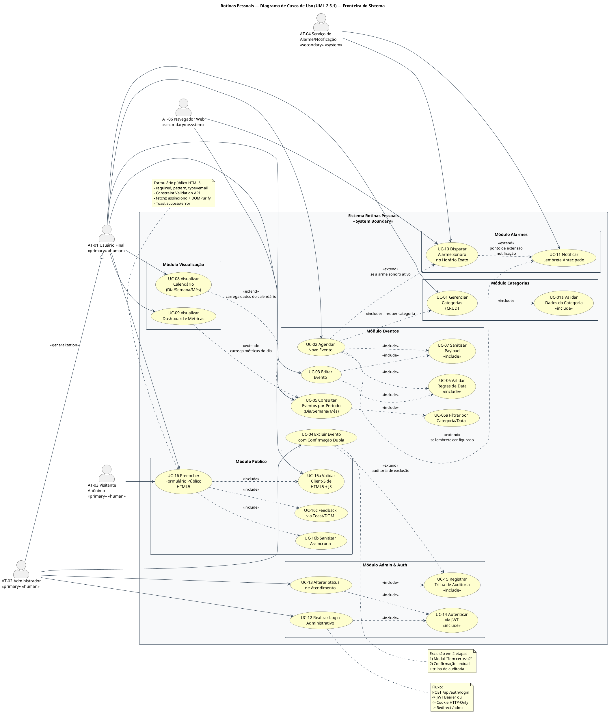
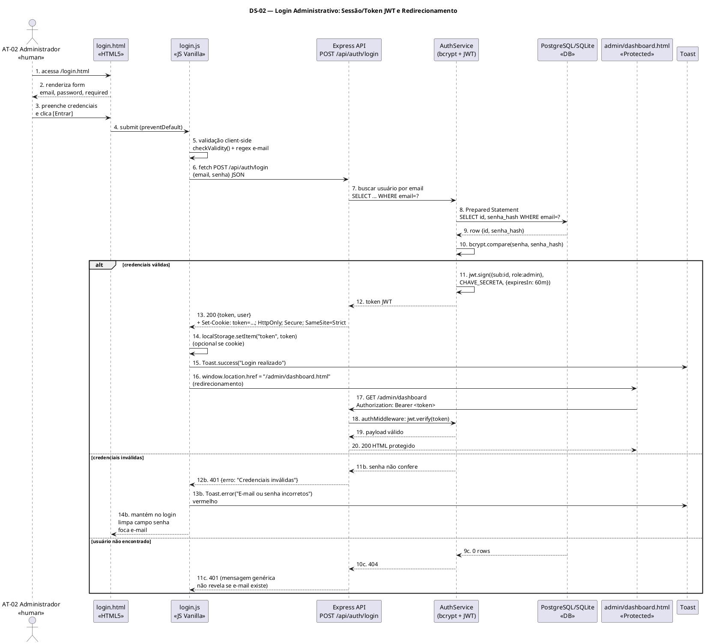
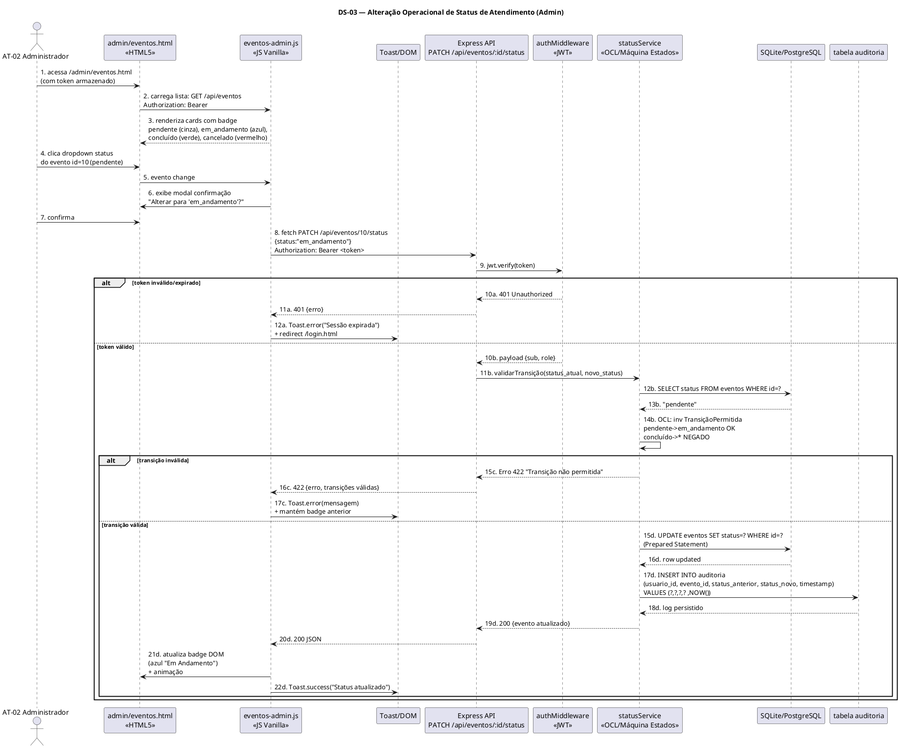
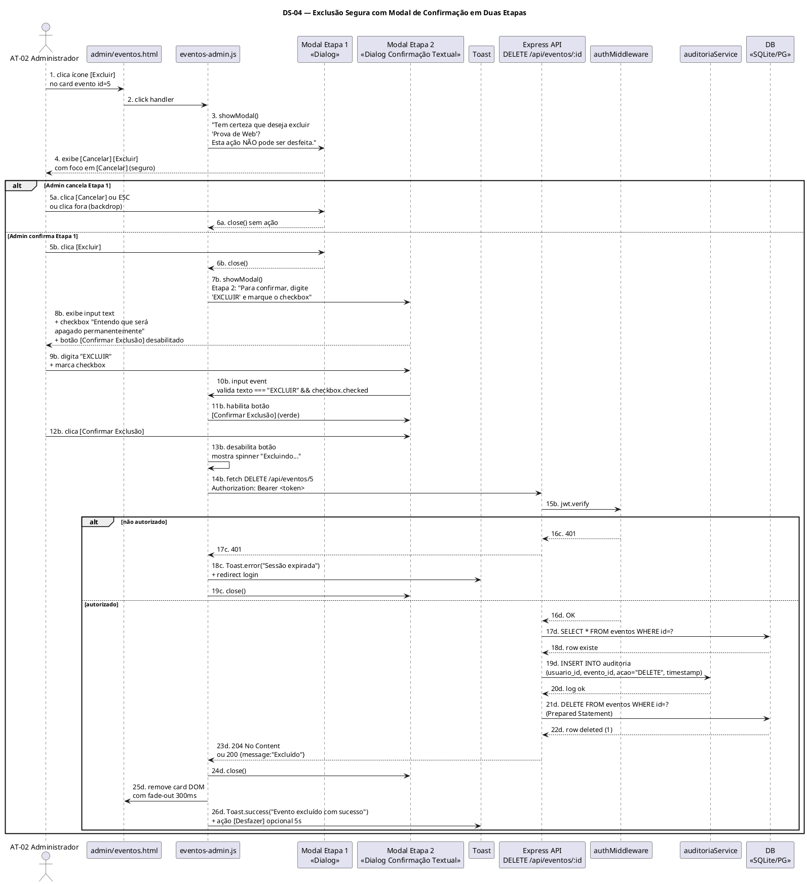

# Especificação de Requisitos de Usuário — Sistema Dinâmico de Gerenciamento de Rotinas (Rotinas Pessoais)

**Documento de Engenharia de Requisitos — Perspectiva de Negócio e Experiência do Usuário**  
**Conformidade:** OMG UML 2.5.1 | ISO/IEC/IEEE 29148:2018 | FURPS+ / ISO/IEC 25010  
**Projeto:** Rotinas Pessoais — IFMT Campus Barra do Garças  
**Versão:** 2.0.0  
**Data:** 03 de Setembro de 2026  
**Autores:** João Eduardo Sousa Ferreira e Lara Ohana Rodrigues Galvão  
**Orientador:** Prof. Carlos David Rocha de Souza  
**Instituição:** Instituto Federal de Mato Grosso (IFMT)  
**Stack de Referência:** Frontend HTML5 Semântico + CSS3 + JavaScript Vanilla/ES6+ | Backend Node.js + Express | Persistência SQLite/PostgreSQL (Prepared Statements)  
**Documentos Relacionados:** `requisitos_de_sistema.md` | `escopo_do_projeto.md` | `requisito_usuario.md` (legado)

---

## Sumário

1. [Introdução e Contexto de Negócio](#1-introdução-e-contexto-de-negócio)
2. [Caracterização Formal de Atores (UML 2.5.1)](#2-caracterização-formal-de-atores-uml-251)
3. [Diagrama de Casos de Uso — PlantUML](#3-diagrama-de-casos-de-uso--plantuml)
4. [Catálogo Detalhado de Requisitos de Usuário (RU)](#4-catálogo-detalhado-de-requisitos-de-usuário-ru)
5. [Histórias de Usuário e Critérios de Aceite BDD/Gherkin](#5-histórias-de-usuário-e-critérios-de-aceite-bddgherkin)
6. [Diagramas de Sequência com Foco no Usuário (PlantUML)](#6-diagramas-de-sequência-com-foco-no-usuário-plantuml)
7. [Matriz de Rastreabilidade RU ↔ Caso de Uso ↔ História](#7-matriz-de-rastreabilidade-ru--caso-de-uso--história)
8. [Glossário e Regras de Negócio Transversais](#8-glossário-e-regras-de-negócio-transversais)
9. [Aprovação](#9-aprovação)

---

## 1. Introdução e Contexto de Negócio

### 1.1 Propósito

Este documento especifica os **Requisitos de Usuário (RU)** do sistema **Rotinas Pessoais** sob a ótica externa, observável e experiencial. Conforme a ISO/IEC/IEEE 29148:2018 §5.2, requisitos de usuário descrevem *o que* o usuário precisa realizar para atingir seus objetivos de negócio, sem prescrever *como* o sistema internamente implementará tal capacidade (esta é responsabilidade do documento `requisitos_de_sistema.md`).

### 1.2 Escopo de Negócio

O sistema centraliza a gestão de rotinas em três domínios de negócio:

| Domínio | Exemplos | Cor Padrão (Sugestão) | Ícone |
|---|---|---|---|
| **Estudantil** | Aulas, provas, entrega de trabalhos IFMT | `#20F9AD` | `FaGraduationCap` |
| **Serviços Domésticos** | Limpeza, compras, manutenção do lar | `#3b82f6` | `FaHome` |
| **Trabalho** | Estágio, freelas, reuniões profissionais | `#f59e0b` | `FaBriefcase` |

Capacidades centrais: cadastro de categorias, agendamento de eventos com recorrência e lembretes, visualização calendarizada (dia/semana/mês), dashboard com métricas do dia, e disparo autônomo de alarmes sonoros e notificações no navegador.

### 1.3 Definições, Acrônimos e Abreviações

| Termo | Definição |
|---|---|
| **RU** | Requisito de Usuário |
| **UC / CSU** | Caso de Uso / Caso de Uso Expandido |
| **HU** | História de Usuário |
| **CA** | Critério de Aceite |
| **BDD/Gherkin** | *Behavior-Driven Development* — formato Dado/Quando/Então |
| **MoSCoW** | Must / Should / Could / Won't |
| **SPA** | Single Page Application |
| **Toast** | Notificação não-bloqueante posicionada no canto da tela |

### 1.4 Correspondência de Stack

> **Nota de Arquitetura:** A implementação acadêmica de referência utiliza **FastAPI + React + SQLite**. Esta especificação documenta a **arquitetura-alvo** solicitada (**Node.js + Express + HTML5/CSS3/JS Vanilla + SQLite/PostgreSQL**). Ambas compartilham o mesmo modelo de domínio (`categorias`, `eventos`), os mesmos contratos REST e as mesmas regras de negócio. A correspondência é 1:1: `EventoForm.jsx` (React) ↔ `evento-form.html + evento-form.js` (Vanilla), `rotina_controller.py` ↔ `evento.controller.js`, `SQLAlchemy ORM` ↔ `pg/sqlite3 com Prepared Statements`.

---

## 2. Caracterização Formal de Atores (UML 2.5.1)

Conforme UML 2.5.1 §18.2.1, um **Ator** é um *Classifier* que especifica um papel desempenhado por uma entidade externa que interage com o *Subject* (o Sistema). Atores são necessariamente externos à fronteira do sistema.

### 2.1 Taxonomia de Atores

| ID | Nome do Ator | Estereótipo UML | Tipo (ISO 29148) | Descrição Formal | Exemplos de Interação |
|---|---|---|---|---|---|
| **AT-01** | **Usuário Final / Estudante** | `<<primary>>` `<<human>>` | Humano Primário | Pessoa física que acessa o sistema via navegador para gerenciar suas rotinas pessoais. É o beneficiário direto de valor. | Criar/editar/excluir categorias e eventos; navegar no calendário; configurar alarmes |
| **AT-02** | **Administrador do Sistema** | `<<primary>>` `<<human>>` | Humano Primário (especialização de AT-01) | Usuário com privilégios adicionais de gestão operacional: alteração de status de atendimento e exclusão segura de registros. Autentica-se via login. | Login; alterar status de evento/atendimento; excluir registros com confirmação em duas etapas |
| **AT-03** | **Visitante Anônimo** | `<<primary>>` `<<human>>` | Humano Primário | Usuário não autenticado que acessa o formulário público (ex.: solicitação/criação de rotina pública ou landing). | Preencher formulário público; visualizar informações institucionais |
| **AT-04** | **Serviço de Alarme e Notificação** | `<<secondary>>` `<<system>>` `<<autonomous>>` | Sistêmico / Ator de Tempo | Agente autônomo client-side (JavaScript Vanilla + Web Audio API + Web Notifications API) que monitora `HH:mm` em tick de 1000 ms e dispara áudio/toast. Ator de tempo (*Time Actor*). | Polling de eventos; disparo de `Audio.play()`; renderização de Toast |
| **AT-05** | **Servidor de API (Node.js/Express)** | `<<secondary>>` `<<system>>` | Sistêmico de Apoio | Subsistema que provê serviços REST, validações, sanitização e persistência. Para efeitos de caso de uso, é secundário que apoia os atores humanos. | Receber `POST /api/eventos`; validar payload; persistir via Prepared Statements |
| **AT-06** | **Navegador Web / User-Agent** | `<<secondary>>` `<<system>>` `<<device>>` | Sistêmico de Infraestrutura | Representa o ambiente de execução HTML5/CSS3/JS que interpreta a interface e expõe APIs (DOM, Audio, Notification, Fetch). | Renderizar HTML5 semântico; executar `fetch()`; tocar áudio |

### 2.2 Hierarquia de Generalização de Atores

```
                  ┌─────────────────────┐
                  │   <<actor>>         │
                  │  Usuário Humano     │  {abstract}
                  └─────────┬───────────┘
                            │ {generalization}
            ┌───────────────┼────────────────┐
            │               │                │
   ┌────────┴────────┐ ┌───┴─────┐   ┌──────┴──────┐
   │  AT-01 Usuário  │ │ AT-02   │   │ AT-03       │
   │  Final          │ │ Admin   │   │ Visitante   │
   │  <<primary>>    │ │<<primary>>  │ <<primary>> │
   └─────────────────┘ └─────────┘   └─────────────┘
            : herda todos os casos de uso de AT-01 + específicos de gestão

   ┌─────────────────┐  ┌──────────────────┐  ┌──────────────────┐
   │ AT-04 Serviço   │  │ AT-05 Servidor   │  │ AT-06 Navegador  │
   │ Alarme <<system>>│  │ API <<system>>  │  │ <<system>>       │
   └─────────────────┘  └──────────────────┘  └──────────────────┘
```

### 2.3 Perfis e Permissões (Matriz RACI Simplificada)

| Capacidade | AT-01 Usuário | AT-02 Admin | AT-03 Visitante | AT-04 Alarme |
|---|---|---|---|---|
| Gerenciar categorias próprias | R/A | R/A | — | — |
| CRUD de eventos | R/A | R/A | C (apenas criar via form público) | I (leitura) |
| Alterar status de atendimento | — | R/A | — | — |
| Exclusão segura com confirmação dupla | — | R/A | — | — |
| Receber alarmes/notificações | I (beneficiário) | I | I | R (executor) |
| Autenticar (login) | R | R | — | — |

> R=Responsável, A=Aprovador, C=Consultado, I=Informado

---

## 3. Diagrama de Casos de Uso — PlantUML

### 3.1 Especificação PlantUML — Fronteira do Sistema, `<<include>>` e `<<extend>>`



### 3.2 Descrição dos Casos de Uso Principais (Resumo)

| Código | Nome | Atores | Tipo | Descrição Resumida |
|---|---|---|---|---|
| **UC-01** | Gerenciar Categorias | AT-01, AT-02 | Essencial | CRUD de categorias (nome, cor HEX, ícone) com validação de unicidade e regex de cor |
| **UC-02** | Agendar Novo Evento | AT-01, AT-02 | Essencial | Criar evento com título, descrição, categoria, intervalo temporal, convidados, cor, lembrete, alarme e recorrência |
| **UC-03** | Editar Evento | AT-01, AT-02 | Essencial | Atualizar qualquer atributo de evento existente com revalidação completa |
| **UC-04** | Excluir Evento com Confirmação Dupla | AT-02 | Essencial | Remoção segura com modal em duas etapas e trilha de auditoria |
| **UC-05** | Consultar Eventos por Período | AT-01, AT-02 | Essencial | Listar eventos filtrados por dia/semana/mês e categoria via `GET /api/eventos` e `GET /api/eventos/dia/{data}` |
| **UC-06** | Validar Regras de Data | — (incluído) | Incluído | Garantir `data_fim >= data_inicio`; recorrência válida; lembrete em enum |
| **UC-07** | Sanitizar Payload | — (incluído) | Incluído | Escape HTML, DOMPurify, Prepared Statements |
| **UC-08** | Visualizar Calendário | AT-01, AT-02 | Essencial | Renderizar grid dia/semana/mês estilo Google Calendar com blocos coloridos |
| **UC-09** | Visualizar Dashboard e Métricas | AT-01, AT-02 | Importante | Exibir total do dia, percentual de progresso, próximo evento iminente |
| **UC-10** | Disparar Alarme Sonoro | AT-04 | Essencial | Tocar áudio exatamente em `HH:mm` via `HTMLAudioElement.play()` em tick 1s |
| **UC-11** | Notificar Lembrete Antecipado | AT-04 | Importante | Notificar `N` minutos antes (`5/10/30/60/1440`) via Toast/Notification API |
| **UC-12** | Realizar Login Administrativo | AT-02 | Essencial | Autenticar com credenciais, receber JWT, redirecionar para área protegida |
| **UC-13** | Alterar Status de Atendimento | AT-02 | Essencial | Transicionar status (ex.: `pendente → em_andamento → concluído`) com validação de máquina de estados |
| **UC-14** | Autenticar via JWT | — (incluído) | Incluído | Validar `Authorization: Bearer <token>` ou cookie HTTP-Only |
| **UC-15** | Registrar Trilha de Auditoria | — (incluído) | Incluído | Persistir log de quem/quando/o que alterou |
| **UC-16** | Preencher Formulário Público HTML5 | AT-01, AT-03 | Essencial | Formulário semântico com validação client-side, sanitização assíncrona e feedback Toast/DOM |

---

## 4. Catálogo Detalhado de Requisitos de Usuário (RU)

> Convenção de IDs: `RU-[MÓDULO]-[SEQ]` — Prioridade MoSCoW: **M**ust, **S**hould, **C**ould, **W**on't (nesta versão).

### 4.1 Módulo CAT — Gestão de Categorias

#### RU-CAT-01 — Cadastrar Nova Categoria

| Campo | Conteúdo |
|---|---|
| **Identificador** | `RU-CAT-01` |
| **Caso de Uso Associado** | `UC-01` (inclui `UC-01a`) |
| **Ator Principal** | `AT-01 Usuário Final` |
| **Atores Secundários** | `AT-05 Servidor API` (validação e persistência) |
| **Prioridade MoSCoW** | **M**ust Have |
| **Descrição** | O usuário deve poder criar categorias personalizadas para classificar eventos, informando nome, cor e ícone. O sistema oferece três categorias padrão pré-semeadas: Estudantil, Serviços Domésticos, Trabalho. |
| **Pré-condições** | 1. Aplicação carregada e API alcançável (`GET /api/saude` retorna 200). 2. Usuário na view `CategoriaManager` (HTML5). 3. `localStorage` ou sessão válida (se modo multiusuário). |
| **Fluxo Operacional (Principal — Happy Path)** | 1. Usuário clica em “Nova Categoria”. 2. Sistema exibe modal/form HTML5 com campos: `nome` (text, required, maxlength 80), `cor` (input type=color + text HEX, pattern `^#[0-9A-Fa-f]{6}$`), `icone` (select de ícones). 3. Usuário preenche e clica “Salvar”. 4. **Validação client-side** (Constraint Validation API): verifica `required`, `maxlength`, `pattern`. Se inválido, exibe mensagem inline. 5. **Sanitização JS**: `DOMPurify.sanitize(nome)` + trim. 6. `fetch POST /api/categorias` com JSON. 7. Servidor valida unicidade de `nome`; se duplicado retorna `400`. 8. Servidor persiste e retorna `201` com objeto criado. 9. Cliente atualiza DOM (lista de categorias), exibe Toast “Categoria criada com sucesso” (verde, 3s), fecha modal. 10. Categoria torna-se disponível no select de `EventoForm`. |
| **Fluxos Alternativos** | A1. Nome duplicado → Toast vermelho “Categoria já existe” + mantém modal aberto. A2. Cor inválida → mensagem inline “Use formato #RRGGBB” e borda vermelha. A3. Falha de rede → Toast “Sem conexão. Tente novamente” + botão Retry. |
| **Pós-condições** | Categoria persistida em `categorias` (SQLite/PostgreSQL); visível em listagens; referenciável por eventos; `data_criacao` preenchida com `CURRENT_TIMESTAMP`. |
| **Regras de Negócio** | RN-CAT-01: `nome` único (case-insensitive). RN-CAT-02: `cor` deve casar `^#[0-9A-Fa-f]{6}$`. RN-CAT-03: `icone` deve pertencer ao catálogo permitido. |
| **Critérios de Qualidade** | Validação < 100 ms client-side; persistência < 200 ms server-side; feedback Toast < 300 ms após resposta. |

#### RU-CAT-02 — Listar, Editar e Excluir Categorias

| Campo | Conteúdo |
|---|---|
| **Identificador** | `RU-CAT-02` |
| **Caso de Uso Associado** | `UC-01` |
| **Ator Principal** | `AT-01 Usuário Final` |
| **Prioridade** | **M**ust Have |
| **Descrição** | O usuário deve visualizar todas as categorias em lista ordenada alfabeticamente, editar atributos e excluir categorias não vinculadas a eventos. |
| **Pré-condições** | Existe ao menos uma categoria cadastrada. |
| **Fluxo Operacional** | 1. Usuário acessa `CategoriaManager`. 2. Sistema executa `GET /api/categorias` e renderiza cards com nome, cor (swatch) e ícone. 3. **Editar:** usuário clica ícone lápis → modal pré-preenchido → altera → PUT `/api/categorias/{id}` → Toast sucesso. 4. **Excluir:** usuário clica lixeira → modal de confirmação simples (“Excluir ‘Estudantil’?”) → confirma → DELETE `/api/categorias/{id}`. 5. Se categoria em uso por eventos, servidor retorna `409 Conflict` → Toast “Não é possível excluir: categoria em uso por N evento(s)” + botão “Ver eventos”. 6. Se livre, retorna `204` → remove do DOM com animação fade-out. |
| **Pós-condições** | Lista consistente com banco; categorias em uso permanecem; exclusão lógica removida fisicamente (hard delete) quando permitida. |
| **Exceções** | E1. Conflito de FK → 409. E2. ID inexistente → 404. |

### 4.2 Módulo EVT — Gestão de Eventos e Compromissos

#### RU-EVT-01 — Agendar Novo Evento / Compromisso

| Campo | Conteúdo |
|---|---|
| **Identificador** | `RU-EVT-01` |
| **Caso de Uso Associado** | `UC-02` (inclui `UC-06`, `UC-07`, `UC-01`) |
| **Ator Principal** | `AT-01 Usuário Final` |
| **Prioridade** | **M**ust Have |
| **Descrição** | Permitir criação de compromissos com dados temporais e operacionais completos, associando categoria existente. |
| **Atributos do Evento** | `titulo`*: String 1..200, required; `descricao`: Text, opcional; `categoria_id`*: FK integer, required; `data_inicio`*: DateTime ISO-8601 UTC-3; `data_fim`*: DateTime >= data_inicio; `convidados`: Text lista de e-mails separados por vírgula; `cor_personalizada`: String HEX opcional; `lembrete_minutos`*: Enum [0,5,10,30,60,1440] default 10; `alarme_sonoro`: String caminho do áudio opcional; `recorrencia`*: Enum [unico, diario, semanal, mensal] default unico |
| **Pré-condições** | 1. Ao menos uma categoria existe. 2. Usuário autenticado (se modo protegido) ou formulário público acessível. 3. Relógio do cliente sincronizado. |
| **Fluxo Operacional** | 1. Usuário clica “Novo Evento” (Dashboard ou CalendarView) ou preenche form público HTML5. 2. Sistema exibe form semântico (`<form novalidate>` controlado por JS): inputs com `required`, `type=datetime-local`, `type=email` (múltiplos), `select` categoria. 3. Usuário preenche; ao sair de cada campo, validação inline JS. 4. Ao submeter, JS intercepta `submit`, previne default, executa validação completa: a. `titulo` não vazio e ≤200; b. `categoria_id` existe no DOM; c. `data_fim >= data_inicio` (comparação `Date`); d. `convidados` cada token valida regex e-mail; e. `cor_personalizada` se presente valida HEX. 5. Sanitização: `escapeHtml` + `DOMPurify` para `titulo/descricao`; trim e lower para e-mails. 6. `fetch POST /api/eventos` com JSON sanitizado. 7. Servidor revalida (Pydantic/express-validator), verifica FK, persiste via Prepared Statement. 8. Retorna `201` com evento criado. 9. Cliente exibe Toast sucesso, limpa form, atualiza CalendarView (insere bloco colorido), agenda no `AlarmManager` se lembrete/alarme ativo. |
| **Pós-condições** | Evento persistido em `eventos`; visível em calendário e dashboard; registrado para disparo de alarme. |
| **Regras de Negócio** | RN-EVT-01: `data_fim >= data_inicio` (OCL: `self.data_fim >= self.data_inicio`). RN-EVT-02: FK `categoria_id` deve existir. RN-EVT-03: `convidados` cada item deve casar `^[^\s@]+@[^\s@]+\.[^\s@]+$`. RN-EVT-04: `recorrencia` gera instâncias virtuais na visualização (não duplica linhas, exceto se materializado). |

#### RU-EVT-02 — Editar Evento Existente

| Campo | Conteúdo |
|---|---|
| **Identificador** | `RU-EVT-02` |
| **Caso de Uso Associado** | `UC-03` (inclui `UC-06`, `UC-07`) |
| **Ator Principal** | `AT-01 Usuário Final` |
| **Prioridade** | **M**ust Have |
| **Descrição** | Atualizar qualquer atributo de evento existente com revalidação integral. |
| **Pré-condições** | Evento com `id` existe e é visível. |
| **Fluxo Operacional** | 1. Usuário clica evento no calendário → modal detalhe → “Editar”. 2. Sistema carrega `GET /api/eventos/{id}` e pré-preenche form (mesmo de criação). 3. Usuário altera campos → submete → `PUT /api/eventos/{id}`. 4. Servidor valida e atualiza; retorna `200` com objeto atualizado. 5. Cliente atualiza DOM (substitui bloco), Toast “Evento atualizado”. |
| **Pós-condições** | Registro atualizado; alarmes re-agendados se horário/lembrete mudou. |

#### RU-EVT-03 — Excluir Evento com Confirmação em Duas Etapas

| Campo | Conteúdo |
|---|---|
| **Identificador** | `RU-EVT-03` |
| **Caso de Uso Associado** | `UC-04` (estende `UC-15` auditoria) |
| **Ator Principal** | `AT-02 Administrador` |
| **Prioridade** | **M**ust Have |
| **Descrição** | Remover evento de forma segura exigindo confirmação modal em duas etapas para evitar exclusão acidental. |
| **Pré-condições** | Usuário autenticado como admin (JWT válido). Evento existe. |
| **Fluxo Operacional** | 1. Usuário clica lixeira no card/evento → **Etapa 1:** Modal “Tem certeza que deseja excluir ‘Prova de Web’? Esta ação não pode ser desfeita.” com botões [Cancelar] [Excluir]. 2. Ao clicar [Excluir], abre **Etapa 2:** Modal exige digitação do título do evento ou palavra “EXCLUIR” + checkbox “Entendo que será apagado permanentemente”. Botão [Confirmar Exclusão] permanece desabilitado até validação textual. 3. Ao confirmar, `fetch DELETE /api/eventos/{id}` com `Authorization: Bearer <token>`. 4. Servidor valida JWT via middleware, registra trilha de auditoria (`usuario_id`, `evento_id`, `timestamp`), executa `DELETE` via Prepared Statement, retorna `204 No Content` ou `200 {message}`. 5. Cliente remove bloco do calendário com animação, exibe Toast “Evento excluído” com ação Desfazer (opcional, se soft-delete). |
| **Pós-condições** | Registro removido (ou marcado `deleted_at` se soft-delete); log de auditoria persistido; alarmes cancelados. |
| **Alternativos** | A1. Cancelar em qualquer etapa → fecha modal sem ação. A2. Token expirado → `401` → redireciona para login + Toast “Sessão expirada”. |

#### RU-EVT-04 — Consultar Eventos por Período / Filtro

| Campo | Conteúdo |
|---|---|
| **Identificador** | `RU-EVT-04` |
| **Caso de Uso Associado** | `UC-05` (inclui `UC-05a`) |
| **Ator Principal** | `AT-01 Usuário Final` |
| **Prioridade** | **M**ust Have |
| **Descrição** | Consultar eventos por data específica ou intervalo (dia/semana/mês) com filtros por categoria. |
| **Pré-condições** | Eventos cadastrados. |
| **Fluxo Operacional** | 1. Usuário navega no calendário (setas ou picker `input type=date`): seleciona dia. 2. Cliente executa `GET /api/eventos/dia/2026-09-05` ou `GET /api/eventos?inicio=2026-09-01&fim=2026-09-30&categoria_id=1`. 3. Servidor filtra via `WHERE data_inicio BETWEEN ? AND ?` (Prepared Statement). 4. Retorna `200` com array JSON. 5. Cliente renderiza blocos; se vazio, exibe empty-state “Nenhum evento neste dia” + CTA “Criar evento”. |
| **Pós-condições** | Lista exibida ordenada por `data_inicio ASC`. |

### 4.3 Módulo DASH — Dashboard e Visualização Calendarizada

#### RU-DSH-01 — Visualizar Calendário Estilo Google Calendar

| Campo | Conteúdo |
|---|---|
| **Identificador** | `RU-DSH-01` |
| **Caso de Uso Associado** | `UC-08` (estende `UC-05`) |
| **Ator Principal** | `AT-01 Usuário Final` |
| **Prioridade** | **M**ust Have |
| **Descrição** | Navegar por calendário interativo em 3 modos: Dia (grid 24h), Semana (7 colunas), Mês (matriz 5-6 semanas). |
| **Fluxo Operacional** | 1. Usuário acessa `/calendario` (ou `calendario.html`). 2. Sistema carrega modo padrão Mês, busca eventos do mês via `GET /api/eventos?inicio=&fim=`. 3. Renderiza células com pílulas coloridas (`background: categoria.cor` ou `cor_personalizada`). 4. Usuário alterna tabs [Dia][Semana][Mês] (JS troca CSS e re-renderiza). 5. Clicar em pílula abre modal detalhe. 6. Clicar em célula vazia pré-preenche novo evento com data/hora da célula. |
| **Pós-condições** | Calendário reflete estado do banco; interação sem reload (SPA Vanilla via `history.pushState` ou navegação tradicional). |

#### RU-DSH-02 — Dashboard Operacional com Métricas

| Campo | Conteúdo |
|---|---|
| **Identificador** | `RU-DSH-02` |
| **Caso de Uso Associado** | `UC-09` |
| **Ator Principal** | `AT-01 Usuário Final` |
| **Prioridade** | **S**hould Have |
| **Descrição** | Tela inicial com métricas sintéticas do dia. |
| **Fluxo Operacional** | 1. Usuário acessa `/` (dashboard.html). 2. Sistema busca `GET /api/eventos/dia/{hoje}`. 3. Calcula e exibe: total de eventos do dia, eventos pendentes vs concluídos, próximo evento iminente (menor `data_inicio > now`), atalhos rápidos [Novo Evento][Nova Categoria]. |
| **Pós-condições** | Dashboard atualizado; métricas recalculadas a cada mutação de eventos. |

### 4.4 Módulo ALM — Alarmes e Notificações

#### RU-ALM-01 — Disparo de Alarme Sonoro no Horário Exato

| Campo | Conteúdo |
|---|---|
| **Identificador** | `RU-ALM-01` |
| **Caso de Uso Associado** | `UC-10` |
| **Ator Principal** | `AT-04 Serviço de Alarme` |
| **Ator Secundário** | `AT-01 Usuário Final` (beneficiário) |
| **Prioridade** | **M**ust Have |
| **Descrição** | Emitir som configurado exatamente em `HH:mm` (UTC-3) com tolerância ≤1s. |
| **Pré-condições** | Evento com `alarme_sonoro` não nulo; permissão de áudio concedida (interação prévia do usuário); aba com `AlarmManager.js` ativo. |
| **Fluxo Operacional** | 1. `AlarmManager.js` carrega eventos do dia ao iniciar e a cada mutação. 2. Inicia `setInterval(1000)` tick. 3. A cada tick, obtém `now = new Date()` ajustado para UTC-3, formata `HH:mm`. 4. Para cada evento, compara `evento.data_inicio (HH:mm) === now (HH:mm)` com verificação de `seconds === 0`. 5. Se match, cria `new Audio(alarme_sonoro)` e executa `play()`. 6. Exibe Toast visual “⏰ Hora do evento: {titulo}” com botão Dispensar/Soneca 5 min. 7. Se usuário clicar Soneca, reagenda `now + 5min`. |
| **Pós-condições** | Áudio tocado; notificação visual exibida; evento marcado como notificado (evitar repetição no mesmo minuto). |

#### RU-ALM-02 — Lembrete Antecipado Configurável

| Campo | Conteúdo |
|---|---|
| **Identificador** | `RU-ALM-02` |
| **Caso de Uso Associado** | `UC-11` (estende `UC-10`) |
| **Ator Principal** | `AT-04 Serviço de Alarme` |
| **Prioridade** | **S**hould Have |
| **Descrição** | Notificar com antecedência de 5/10/30/60/1440 minutos antes do evento. |
| **Fluxo Operacional** | 1. No mesmo tick, calcula `lembrete_time = data_inicio - lembrete_minutos*60000`. 2. Se `lembrete_time (HH:mm) === now (HH:mm)` e `seconds===0`, dispara Notification API (se permissão granted) + Toast amarelo “Lembrete: {titulo} em {lembrete_minutos} min”. 3. Não toca áudio de alarme neste momento (somente no horário exato). |
| **Pós-condições** | Lembrete exibido uma única vez por evento. |

### 4.5 Módulo AUTH — Autenticação e Gestão Operacional

#### RU-AUTH-01 — Login Administrativo com Sessão/Token e Redirecionamento

| Campo | Conteúdo |
|---|---|
| **Identificador** | `RU-AUTH-01` |
| **Caso de Uso Associado** | `UC-12` (inclui `UC-14`) |
| **Ator Principal** | `AT-02 Administrador` |
| **Prioridade** | **M**ust Have |
| **Descrição** | Autenticar administrador via credenciais e estabelecer sessão stateless ou cookie seguro, com redirecionamento para área protegida. |
| **Pré-condições** | Conta admin existente (seed ou cadastro). Página `login.html` acessível. |
| **Fluxo Operacional** | 1. Visitante acessa `login.html` → form HTML5 com `type=email`, `type=password`, `required`, `autocomplete`. 2. Preenche e submete → JS valida client-side → `fetch POST /api/auth/login` com `{email, senha}`. 3. Servidor valida via `bcrypt.compare`, gera JWT `HS256` com `exp` (ex.: 60 min) e retorna `{token}` + `Set-Cookie: token=...; HttpOnly; Secure; SameSite=Strict` (opcional). 4. Cliente armazena token em `localStorage` (ou usa cookie), exibe Toast “Login realizado”, e redireciona (`window.location.href = "/admin/dashboard.html"` ou `"/calendario.html"`). 5. Requisições subsequentes enviam `Authorization: Bearer <token>`. 6. Middleware `authMiddleware` valida JWT; se inválido/expirado, retorna `401` e cliente redireciona para login. |
| **Pós-condições** | Sessão estabelecida; rotas protegidas acessíveis; token com expiração. |

#### RU-AUTH-02 — Alteração Operacional de Status de Atendimento

| Campo | Conteúdo |
|---|---|
| **Identificador** | `RU-AUTH-02` |
| **Caso de Uso Associado** | `UC-13` (inclui `UC-14`, `UC-15`) |
| **Ator Principal** | `AT-02 Administrador` |
| **Prioridade** | **M**ust Have |
| **Descrição** | Alterar status operacional de um evento/atendimento seguindo máquina de estados controlada, com auditoria. |
| **Pré-condições** | Usuário autenticado como admin; evento existe. |
| **Fluxo Operacional** | 1. Admin visualiza lista de eventos em `/admin/eventos.html` com badge de status (`pendente`, `em_andamento`, `concluído`, `cancelado`). 2. Clica dropdown de status → seleciona novo status → confirma em modal simples. 3. Cliente executa `PATCH /api/eventos/{id}/status` com `{status: "em_andamento"}` e `Authorization`. 4. Servidor valida transição via invariante OCL (ex.: `pendente -> em_andamento -> concluído`; `cancelado` terminal); se inválida retorna `422` com mensagem. 5. Se válida, atualiza via Prepared Statement, insere registro em `auditoria` (`usuario_id`, `evento_id`, `status_anterior`, `status_novo`, `timestamp`), retorna `200`. 6. Cliente atualiza badge no DOM, exibe Toast “Status atualizado”, registra log visual. |
| **Pós-condições** | Status persistido; auditoria registrada; UI reflete novo estado; transições inválidas bloqueadas. |
| **Máquina de Estados** | `pendente --(iniciar)--> em_andamento --(concluir)--> concluído`; `pendente/em_andamento --(cancelar)--> cancelado`; `concluído/cancelado` são finais (sem saída). |

#### RU-PUB-01 — Formulário Público HTML5 com Validação, Sanitização Assíncrona e Feedback Toast/DOM

| Campo | Conteúdo |
|---|---|
| **Identificador** | `RU-PUB-01` |
| **Caso de Uso Associado** | `UC-16` (inclui `UC-16a`, `UC-16b`, `UC-16c`) |
| **Ator Principal** | `AT-03 Visitante Anônimo` / `AT-01 Usuário Final` |
| **Prioridade** | **M**ust Have |
| **Descrição** | Disponibilizar formulário público semântico (HTML5) para criação de solicitações/eventos com validação client-side imediata, sanitização assíncrona e feedback não-bloqueante. |
| **Pré-condições** | Página pública acessível sem autenticação (ex.: `index.html` ou `solicitar.html`). |
| **Fluxo Operacional** | 1. Sistema renderiza `<form id="form-publico" novalidate>` com campos HTML5: `<input type="text" required minlength="3" maxlength="200">`, `<input type="email" required>`, `<input type="datetime-local" required>`, `<select required>`, `<textarea maxlength="500">`. 2. **Validação client-side síncrona (UC-16a):** a cada `blur`/`input`, JS usa `Constraint Validation API` (`input.validity`, `setCustomValidity`) para exibir mensagens inline (`<span class="erro">`) e bordas vermelhas/verdes; ao `submit`, verifica `form.checkValidity()`. Se inválido, foca primeiro campo inválido e exibe Toast vermelho “Corrija os campos destacados”. 3. **Sanitização assíncrona (UC-16b):** antes do `fetch`, JS executa `DOMPurify.sanitize` e `escapeHtml` para `titulo/descricao`; opcionalmente chama endpoint `POST /api/sanitize/preview` para validação server-side assíncrona (retorna payload sanitizado e warnings). 4. **Envio:** `fetch POST /api/eventos` (ou `/api/solicitacoes`) com JSON sanitizado; desabilita botão e mostra spinner. 5. **Feedback Toast/DOM (UC-16c):** Se `201`, exibe Toast verde “Solicitação enviada com sucesso!” + limpa form + insere card na lista via DOM (`insertAdjacentHTML`) sem reload. Se `400/422`, exibe Toast vermelho com mensagem de erro e mantém dados para correção. Se falha de rede, Toast amarelo com botão Tentar novamente. Toast auto-dismiss em 4s, com botão fechar manual e `aria-live="polite"`. |
| **Pós-condições** | Dados sanitizados e persistidos; usuário recebe feedback imediato; form resetado ou preservado conforme resultado. |

---

## 5. Histórias de Usuário e Critérios de Aceite BDD/Gherkin

> Formato: **Como** [ator], **Quero** [objetivo], **Para** [benefício]. Critérios em **Dado/Quando/Então** (BDD).

### 5.1 HU-CAT-01 — Criar Categoria

**História:** Como usuário final, quero criar categorias personalizadas com nome, cor e ícone, para organizar meus eventos por domínio (estudantil, doméstico, trabalho).

```gherkin
# language: pt
Funcionalidade: Gerenciar categorias

  Cenário: Criar categoria com dados válidos
    Dado que estou na página "Gerenciar Categorias"
    E o servidor está alcançável
    Quando preencho "nome" com "Estudos IFMT"
    E seleciono "cor" como "#20F9AD"
    E seleciono "icone" como "FaBook"
    E clico em "Salvar"
    Então o sistema valida client-side que o nome não está vazio e a cor casa com "^#[0-9A-Fa-f]{6}$"
    E envia POST /api/categorias com payload sanitizado
    E o servidor persiste e retorna 201 com o objeto criado
    E a UI exibe Toast "Categoria criada com sucesso" e a nova categoria aparece na lista

  Cenário: Tentar criar categoria com nome duplicado
    Dado que já existe categoria com nome "Trabalho"
    Quando tento criar nova categoria com nome "trabalho" (case-insensitive)
    Então o servidor retorna 400 "Categoria já existente"
    E a UI exibe Toast de erro e mantém o modal aberto para correção

  Cenário: Cor em formato inválido
    Dado que estou no formulário de categoria
    Quando preencho "cor" com "azul" ou "#GGGGGG"
    Então a validação inline exibe "Use formato #RRGGBB"
    E o botão Salvar permanece desabilitado
```

### 5.2 HU-CAT-02 — Editar e Excluir Categoria

**História:** Como usuário final, quero editar e, quando não estiver em uso, excluir categorias, para manter minha organização atualizada.

```gherkin
  Cenário: Editar categoria existente
    Dado que existe categoria "Serviços Domésticos" com cor "#3b82f6"
    Quando clico em "Editar", altero cor para "#ef4444" e salvo
    Então o sistema envia PUT /api/categorias/{id} e retorna 200
    E a lista reflete a nova cor imediatamente

  Cenário: Excluir categoria em uso por eventos
    Dado que a categoria "Estudantil" está vinculada a 3 eventos
    Quando clico em "Excluir" e confirmo
    Então o servidor retorna 409 Conflict "Categoria em uso"
    E a UI exibe Toast com botão "Ver eventos" e não remove a categoria

  Cenário: Excluir categoria livre
    Dado que a categoria "Temporária" não possui eventos vinculados
    Quando confirmo a exclusão
    Então o servidor retorna 204 e a categoria é removida do DOM com animação
```

### 5.3 HU-EVT-01 — Agendar Novo Evento

**História:** Como usuário final, quero agendar eventos completos (título, categoria, datas, lembrete, recorrência) para não perder compromissos.

```gherkin
  Cenário: Agendar evento válido com lembrete e recorrência
    Dado que existe categoria "Estudantil" com id 1
    E estou no formulário de novo evento
    Quando preencho titulo "Prova de Desenvolvimento Web", categoria 1, data_inicio "05/09/2026 08:00", data_fim "05/09/2026 10:00", lembrete 30, recorrencia "unico"
    E clico em "Salvar"
    Então o JS valida que data_fim >= data_inicio e sanitiza titulo/descricao
    E envia POST /api/eventos e recebe 201
    E o evento aparece no calendário no dia 05/09/2026 e é agendado no AlarmManager

  Cenário: Data fim anterior à data início
    Dado que preencho data_inicio "05/09/2026 10:00" e data_fim "05/09/2026 08:00"
    Quando tento salvar
    Então a validação client-side exibe "Data fim deve ser posterior ao início"
    E o servidor, se receber, retorna 422 Unprocessable Entity

  Cenário: Categoria inexistente
    Dado que informo categoria_id 999 inexistente
    Quando envio o formulário
    Então o servidor retorna 404 Not Found "Categoria não encontrada"
    E a UI mantém os dados para correção

  Cenário: E-mails de convidados inválidos
    Dado que preencho convidados com "joao@, invalido"
    Quando tento salvar
    Então a validação exibe "E-mail inválido" inline no campo convidados
    E o envio é bloqueado até correção
```

### 5.4 HU-EVT-02 — Editar Evento

**História:** Como usuário final, quero editar eventos existentes para ajustar horários ou detalhes sem precisar recriar.

```gherkin
  Cenário: Editar título e horário de evento
    Dado que existe evento id 10 com titulo "Reunião" às 14:00
    Quando abro o evento, altero titulo para "Reunião com Orientador" e horário para 15:00 e salvo
    Então o sistema envia PUT /api/eventos/10 e retorna 200
    E o calendário atualiza o bloco para novo horário e título
    E o AlarmManager reagenda o alarme para o novo horário

  Cenário: Edição com dados inválidos
    Dado que ao editar deixo titulo vazio
    Quando tento salvar
    Então a validação client-side impede o envio e exibe "Título é obrigatório"
```

### 5.5 HU-EVT-03 — Exclusão Segura em Duas Etapas

**História:** Como administrador, quero excluir eventos com confirmação em duas etapas para evitar exclusões acidentais e garantir auditoria.

```gherkin
  Cenário: Exclusão com confirmação em duas etapas bem-sucedida
    Dado que estou autenticado como administrador com JWT válido
    E existe evento "Prova de Web" id 5
    Quando clico em "Excluir" no evento
    Então o sistema exibe Modal Etapa 1 "Tem certeza? Esta ação não pode ser desfeita" com [Cancelar] [Excluir]
    Quando clico em [Excluir]
    Então o sistema exibe Modal Etapa 2 solicitando digitar "EXCLUIR" e marcar checkbox de confirmação
    E o botão [Confirmar Exclusão] só habilita após digitação correta e checkbox marcado
    Quando digito "EXCLUIR", marco o checkbox e clico [Confirmar Exclusão]
    Então o sistema envia DELETE /api/eventos/5 com Authorization Bearer
    E o servidor valida JWT, registra auditoria e retorna 204
    E a UI remove o evento do calendário e exibe Toast "Evento excluído"

  Cenário: Cancelamento na primeira etapa
    Dado que o modal de exclusão etapa 1 está aberto
    Quando clico em [Cancelar] ou pressiono ESC
    Então o modal fecha e nenhuma requisição é enviada

  Cenário: Token expirado durante exclusão
    Dado que meu JWT expirou
    Quando confirmo a exclusão
    Então o servidor retorna 401 Unauthorized
    E a UI redireciona para /login.html com Toast "Sessão expirada. Faça login novamente"

  Cenário: Tentativa de exclusão sem autenticação
    Dado que não estou autenticado
    Quando tento DELETE /api/eventos/5
    Então o servidor retorna 401 e a UI bloqueia a ação
```

### 5.6 HU-EVT-04 — Consulta por Período

**História:** Como usuário final, quero filtrar eventos por dia/semana/mês para visualizar minha agenda no período desejado.

```gherkin
  Cenário: Consultar eventos de um dia específico
    Dado que existem eventos em 05/09/2026
    Quando seleciono a data "05/09/2026" no calendário
    Então o sistema executa GET /api/eventos/dia/2026-09-05
    E retorna 200 com array ordenado por data_inicio
    E renderiza os blocos no grid do dia

  Cenário: Dia sem eventos
    Dado que não há eventos em 06/09/2026
    Quando consulto esse dia
    Então a UI exibe empty-state "Nenhum evento neste dia" com CTA "Criar evento"
```

### 5.7 HU-DSH-01 — Calendário Dia/Semana/Mês

**História:** Como usuário final, quero alternar entre visões dia/semana/mês para ter diferentes granularidades da minha rotina.

```gherkin
  Cenário: Alternar para visão Semana
    Dado que estou na visão Mês com eventos carregados
    Quando clico na aba "Semana"
    Então o sistema re-renderiza o grid com 7 colunas (Dom-Sab)
    E posiciona cada evento no dia/coluna correspondente com cor da categoria
    E mantém a data de referência selecionada

  Cenário: Clicar em célula vazia para criar evento
    Dado que estou na visão Dia
    Quando clico na célula vazia de "10:00"
    Então o sistema abre o formulário de novo evento pré-preenchido com data_inicio 10:00 do dia atual
```

### 5.8 HU-DSH-02 — Dashboard com Métricas

**História:** Como usuário final, quero ver no dashboard quantos eventos tenho hoje e qual o próximo compromisso, para priorizar meu dia.

```gherkin
  Cenário: Dashboard carrega métricas do dia
    Dado que hoje é 03/09/2026 e tenho 3 eventos hoje, 1 concluído
    Quando acesso o dashboard
    Então o sistema busca GET /api/eventos/dia/2026-09-03
    E exibe "3 eventos hoje", "33% concluído", e card "Próximo: Prova 08:00"
    E exibe atalhos [Novo Evento] [Nova Categoria]

  Cenário: Nenhum evento hoje
    Dado que não tenho eventos hoje
    Quando acesso o dashboard
    Então exibe "Nenhum evento hoje. Aproveite o dia!" e CTA para criar
```

### 5.9 HU-ALM-01 — Alarme Sonoro

**História:** Como usuário final, quero ouvir um alarme exatamente no horário do evento para não perdê-lo, mesmo com o navegador em segundo plano.

```gherkin
  Cenário: Alarme dispara no horário exato
    Dado que tenho evento "Aula" às 14:30 com alarme_sonoro "bip.mp3"
    E o AlarmManager está ativo com tick de 1s
    Quando o relógio atinge 14:30:00 (UTC-3)
    Então o sistema instancia new Audio("bip.mp3") e executa play()
    E exibe Toast "⏰ Hora do evento: Aula" com botões [Dispensar] [Soneca 5min]

  Cenário: Soneca de 5 minutos
    Dado que o alarme tocou
    Quando clico em "Soneca 5min"
    Então o sistema agenda novo disparo para 14:35:00
    E silencia o áudio atual

  Cenário: Evento sem alarme configurado não dispara som
    Dado que evento não possui alarme_sonoro
    Quando atinge seu horário
    Então nenhum áudio é tocado, apenas Toast de lembrete se configurado
```

### 5.10 HU-ALM-02 — Lembrete Antecipado

**História:** Como usuário final, quero ser lembrado 30 minutos antes do evento para me preparar.

```gherkin
  Cenário: Lembrete 30 minutos antes
    Dado que evento "Prova" é às 08:00 com lembrete_minutos 30
    Quando o relógio atinge 07:30:00
    Então o sistema exibe Toast/Notification "Lembrete: Prova em 30 min"
    E não toca o áudio principal (só às 08:00)

  Cenário: Lembrete 1440 minutos (24h antes)
    Dado que evento é amanhã 08:00 com lembrete 1440
    Quando o relógio atinge hoje 08:00:00
    Então o sistema notifica "Lembrete: evento amanhã"
```

### 5.11 HU-AUTH-01 — Login Administrativo

**História:** Como administrador, quero fazer login com email/senha para acessar funcionalidades protegidas.

```gherkin
  Cenário: Login com credenciais válidas
    Dado que existe admin "admin@ifmt.edu.br" com senha "123456"
    E estou em login.html
    Quando preencho email e senha e clico Entrar
    Então o JS valida client-side e envia POST /api/auth/login
    E o servidor retorna 200 com {token} e Set-Cookie HttpOnly
    E a UI salva o token e redireciona para /admin/dashboard.html com Toast "Login realizado"

  Cenário: Credenciais inválidas
    Dado que informo senha incorreta
    Quando tento logar
    Então o servidor retorna 401 "Credenciais inválidas"
    E a UI exibe Toast vermelho e mantém no login

  Cenário: Acesso a rota protegida sem token
    Dado que não estou autenticado
    Quando tento acessar /admin/eventos.html
    Então o middleware retorna 401 e o JS redireciona para login.html
```

### 5.12 HU-AUTH-02 — Alteração de Status de Atendimento

**História:** Como administrador, quero alterar o status de um evento (pendente → em andamento → concluído) para refletir o progresso operacional.

```gherkin
  Cenário: Transição válida pendente -> em_andamento
    Dado que estou autenticado como admin
    E evento id 10 está com status "pendente"
    Quando seleciono novo status "em_andamento" e confirmo
    Então o sistema envia PATCH /api/eventos/10/status com {status:"em_andamento"} e Bearer token
    E o servidor valida a máquina de estados, atualiza e registra auditoria, retorna 200
    E a UI atualiza o badge para "Em Andamento" (azul) e exibe Toast "Status atualizado"

  Cenário: Transição inválida concluído -> pendente
    Dado que evento está "concluído" (estado final)
    Quando tento alterar para "pendente"
    Então o servidor retorna 422 "Transição de status não permitida"
    E a UI exibe Toast de erro e mantém status anterior

  Cenário: Status cancelado é terminal
    Dado que evento está "cancelado"
    Quando tento qualquer transição
    Então o servidor bloqueia com 422 e a UI desabilita o dropdown
```

### 5.13 HU-PUB-01 — Formulário Público com Validação e Toast

**História:** Como visitante, quero preencher um formulário público com feedback imediato para enviar minha solicitação sem recarregar a página.

```gherkin
  Cenário: Preenchimento válido com feedback Toast
    Dado que estou na página pública com formulário HTML5
    Quando preencho todos os campos corretamente e clico Enviar
    Então o JS valida via checkValidity(), sanitiza com DOMPurify e envia fetch POST
    E o servidor retorna 201
    E a UI exibe Toast verde "Solicitação enviada!" , limpa o formulário e insere o card na lista via DOM

  Cenário: Campo obrigatório vazio
    Dado que deixo "titulo" vazio e tento enviar
    Quando o formulário é submetido
    Então a validação inline exibe "Preencha este campo" sob o input e foca nele
    E o fetch não é executado

  Cenário: Sanitização bloqueia XSS
    Dado que preencho titulo com "<script>alert(1)</script>"
    Quando envio
    Então o JS sanitiza para "&lt;script&gt;" antes do fetch
    E o servidor re-sanitiza e persiste texto escapado
    E a UI renderiza texto literal sem executar script

  Cenário: Erro de rede com retry
    Dado que estou offline ao enviar
    Quando clico Enviar
    Então o fetch falha e a UI exibe Toast amarelo "Sem conexão" com botão [Tentar novamente]
    E mantém os dados preenchidos
```

---

## 6. Diagramas de Sequência com Foco no Usuário (PlantUML)

### 6.1 DS-01 — Formulário Público HTML5 com Validação Client-Side, Sanitização Assíncrona e Feedback via Toast/DOM

```plantuml
@startuml DS_FormPublico
title DS-01 — Formulário Público HTML5: Validação, Sanitização Assíncrona e Feedback Toast/DOM

actor "AT-03 Visitante\n<<human>>" as Visitante
participant "form-publico.html\n<<HTML5>>" as HTML
participant "form-publico.js\n<<JS Vanilla>>" as JS
participant "DOMPurify\n+ Constraint API" as Sanitize
participant "Toast/DOM\nRenderer" as Toast
participant "Express API\nPOST /api/eventos" as API
participant "SQLite/PostgreSQL\n<<DB>>" as DB

Visitente -> HTML : 1. acessa página pública\n(GET /solicitar.html)
HTML --> Visitente : 2. renderiza <form novalidate>\ncom required, type=email,\npattern, maxlength

Visitente -> HTML : 3. preenche campo (ex.: titulo)\ne dispara blur/input
HTML -> JS : 4. evento input/blur
JS -> Sanitize : 5. input.checkValidity()\n+ setCustomValidity()
Sanitize --> JS : 6. validity.valid?\nfalse -> mensagem inline
JS -> HTML : 7. exibe <span class="erro">\n+ borda vermelha/verde

Visitente -> HTML : 8. clica [Enviar] (submit)
HTML -> JS : 9. evento submit\n(preventDefault)
JS -> JS : 10. form.checkValidity()\nse inválido -> foca 1º inválido\nToast vermelho "Corrija campos"

JS -> Sanitize : 11. DOMPurify.sanitize(titulo)\n+ escapeHtml(descricao)\n+ trim/normalize e-mails
Sanitize --> JS : 12. payload sanitizado

JS -> JS : 13. desabilita botão\nmostra spinner

JS -> API : 14. fetch POST /api/eventos\nJSON sanitizado\n[assíncrono]
API -> API : 15. middleware sanitização\n(express-validator)\nescape + trim
API -> DB : 16. Prepared Statement:\nINSERT INTO eventos (...) VALUES (?,?,...)

alt sucesso (201 Created)
  DB --> API : 17. row inserida
  API --> JS : 18. 201 {id, titulo, ...}
  JS -> Toast : 19. Toast.success("Solicitação enviada!")\nverde, 4s, aria-live
  JS -> HTML : 20. form.reset()\n+ insertAdjacentHTML(card)\n+ atualiza lista via DOM\nsem reload
else validação server-side (400/422)
  API --> JS : 18b. 400/422 {erro, campo}
  JS -> Toast : 19b. Toast.error(mensagem)\nvermelho
  JS -> HTML : 20b. destaca campo com erro\nmantém dados
else falha de rede
  JS --> JS : 18c. fetch catch (offline)
  JS -> Toast : 19c. Toast.warning("Sem conexão")\n+ botão [Tentar novamente]
end

JS -> JS : 21. reabilita botão\nesconde spinner

@enduml
```



**Descrição Narrativa DS-01:** Cobre o fluxo completo de UX do formulário público sem recarregar a página. A validação é em duas camadas: client-side imediata (Constraint Validation API) para feedback instantâneo e server-side via middleware Express. A sanitização ocorre tanto no cliente (DOMPurify) quanto no servidor (express-validator + escape). O feedback é sempre via Toast não-bloqueante e manipulação direta do DOM (`insertAdjacentHTML`), caracterizando SPA Vanilla sem framework.

### 6.2 DS-02 — Fluxo de Login Administrativo com Sessão/Token e Redirecionamento



**Descrição Narrativa DS-02:** Modela autenticação stateless com JWT. O token pode ser transportado via `Authorization: Bearer` (localStorage) ou cookie HTTP-Only (mais seguro contra XSS). O redirecionamento é feito via `window.location` após persistência do token. O middleware de autenticação protege todas as rotas `/admin/*` e `/api/eventos` mutáveis, retornando `401` quando expirado.

### 6.3 DS-03 — Alteração Operacional de Status de Atendimento



**Descrição Narrativa DS-03:** Demonstra a máquina de estados com invariantes OCL. A validação ocorre no Service, não apenas no Controller. Cada transição gera trilha de auditoria para rastreabilidade. O feedback é imediato via atualização do badge no DOM.

### 6.4 DS-04 — Exclusão Segura de Registros com Diálogo Modal de Confirmação em Duas Etapas



**Descrição Narrativa DS-04:** Padrão de segurança para operações destrutivas. A primeira etapa é um alerta simples; a segunda exige ação cognitiva (digitar palavra de confirmação) para evitar cliques acidentais. Inclui auditoria e tratamento de `401`. O botão de confirmação permanece desabilitado até a validação textual, seguindo princípios de *usabilidade segura*.

---

## 7. Matriz de Rastreabilidade RU ↔ Caso de Uso ↔ História

| Requisito RU | Caso de Uso | História(s) | Componente Frontend (HTML5/JS) | Endpoint(s) Backend | Tabela(s) | Prioridade |
|---|---|---|---|---|---|---|
| `RU-CAT-01` | `UC-01` | `HU-CAT-01` | `categoria-manager.html` + `categoria-manager.js` | `POST /api/categorias` | `categorias` | Must |
| `RU-CAT-02` | `UC-01` | `HU-CAT-02` | `categoria-manager.html` | `GET/PUT/DELETE /api/categorias` | `categorias` | Must |
| `RU-EVT-01` | `UC-02` | `HU-EVT-01` | `evento-form.html` + `evento-form.js` | `POST /api/eventos` | `eventos` | Must |
| `RU-EVT-02` | `UC-03` | `HU-EVT-02` | `evento-form.html` | `PUT /api/eventos/:id` | `eventos` | Must |
| `RU-EVT-03` | `UC-04` | `HU-EVT-03` | `admin/eventos.html` + `modal.js` | `DELETE /api/eventos/:id` | `eventos`, `auditoria` | Must |
| `RU-EVT-04` | `UC-05` | `HU-EVT-04` | `calendario.html` + `calendario.js` | `GET /api/eventos`, `GET /api/eventos/dia/:data` | `eventos` | Must |
| `RU-DSH-01` | `UC-08` | `HU-DSH-01` | `calendario.html` + `calendario.js` | `GET /api/eventos?inicio=&fim=` | `eventos`, `categorias` | Must |
| `RU-DSH-02` | `UC-09` | `HU-DSH-02` | `dashboard.html` + `dashboard.js` | `GET /api/eventos/dia/:data` | `eventos` | Should |
| `RU-ALM-01` | `UC-10` | `HU-ALM-01` | `alarm-manager.js` (Web Audio API) | — (client-side) | `eventos` (leitura) | Must |
| `RU-ALM-02` | `UC-11` | `HU-ALM-02` | `alarm-manager.js` | — | `eventos` | Should |
| `RU-AUTH-01` | `UC-12` | `HU-AUTH-01` | `login.html` + `login.js` | `POST /api/auth/login` | `usuarios` | Must |
| `RU-AUTH-02` | `UC-13` | `HU-AUTH-02` | `admin/eventos.html` | `PATCH /api/eventos/:id/status` | `eventos`, `auditoria` | Must |
| `RU-PUB-01` | `UC-16` | `HU-PUB-01` | `solicitar.html` + `form-publico.js` + `toast.js` | `POST /api/eventos` | `eventos` | Must |

---

## 8. Glossário e Regras de Negócio Transversais

### 8.1 Regras de Negócio Gerais

| ID | Regra | Descrição | Onde Aplicada |
|---|---|---|---|
| **RN-GER-01** | Formato Regional | Datas `dd/mm/yyyy`, hora `HH:mm` 24h, fuso `UTC-3` (America/Sao_Paulo ou America/Cuiaba) | Todos os forms e exibições; `date-fns` com `pt-BR` ou `Intl.DateTimeFormat` |
| **RN-GER-02** | Sanitização Obrigatória | Todo input de texto deve ser sanitizado contra XSS (escape HTML + DOMPurify) e SQL Injection via Prepared Statements | Frontend `form-*.js` e Backend `middlewares/sanitize.js` |
| **RN-GER-03** | Validação Dupla | Validação client-side (UX) + server-side (segurança); nunca confiar apenas no cliente | Constraint API + express-validator |
| **RN-GER-04** | Feedback em até 300 ms | Toda ação do usuário deve gerar feedback visual em até 300 ms (Toast, borda, spinner) | `toast.js`, `DOM` |
| **RN-GER-05** | Unicidade de Categoria | `nome` de categoria único case-insensitive | `categorias.nome` UNIQUE + check em controller |
| **RN-GER-06** | Integridade Referencial | Não excluir categoria em uso (409); `data_fim >= data_inicio` | FK `RESTRICT`, OCL |
| **RN-GER-07** | Tolerância de Alarme | Disparo de alarme com tolerância ≤1s | `AlarmManager` tick 1000 ms |

### 8.2 Requisitos de Acessibilidade (ISO 25010 — Usabilidade)

- Uso de HTML5 semântico (`<header>`, `<main>`, `<section>`, `<form>`, `<dialog>`, `<time>`).
- `label` associado a cada input via `for`/`id`.
- Toast com `role="status"` e `aria-live="polite"` para leitores de tela.
- Contraste de cores ≥4.5:1 (WCAG AA) e navegação por teclado (Tab, ESC para modais).

---

## 9. Aprovação

| Papel | Nome | Assinatura | Data |
|---|---|---|---|
| **Gerente de Projeto / Autor** | João Eduardo Sousa Ferreira | _________________________ | 03/09/2026 |
| **Desenvolvedora / Autora** | Lara Ohana Rodrigues Galvão | _________________________ | 03/09/2026 |
| **Orientador** | Prof. Carlos David Rocha de Souza | _________________________ | 03/09/2026 |
| **Arquiteto de Software (UML 2.5.1)** | Especialista | _________________________ | 03/09/2026 |

> **Status:** APROVADO PARA DESENVOLVIMENTO — Este documento serve como baseline para `requisitos_de_sistema.md` (especificação técnica interna).

---

*Fim do documento `requisitos_de_usuario.md` — v2.0.0 — 03/09/2026*
